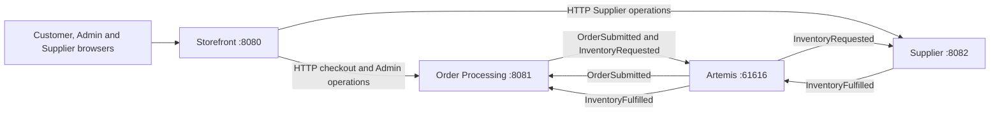

# Java Pet Store modernization

A challenge project modernizing Java Pet Store 1.3.1_02 to **Java 21, Spring Boot 4.1.1 and MongoDB 7**. The optional MongoDB stretch goal is implemented. Migration follows verified legacy business behavior while replacing EJB/CMP/JSP infrastructure with Spring services, Mongo aggregates, Thymeleaf and Artemis messaging.

## Architecture and lifecycle

| Service | Port | Owns | Database |
|---|---|---|---|
| Storefront | 8080 | Authentication, account, catalog/search, session cart, checkout, customer/Admin/Supplier browser UIs | `petstore_storefront` |
| Order Processing | 8081 | Order snapshots, automatic/manual approval, denial, fulfilment progress | `petstore_orders` |
| Supplier | 8082 | Inventory, allocation, partial fulfilment, shipment history, replenishment | `petstore_supplier` |



Customer checkout persists `PENDING`. Asynchronous approval accepts `en-US` totals **< 500** and `ja-JP` totals **< 50000**. Other orders remain pending for Admin approval/denial. Approved orders proceed to Supplier and become `SHIPPED_PART` or `COMPLETED`; replenishment retries outstanding lines. Denied orders stop. Only a valid synchronous creation response clears the session cart; checkout failures retain it.

There are no cross-service Java/Maven domain dependencies or repository accesses. One local Mongo process hosts three service-owned databases. Browser traffic uses **http://localhost:8080** exclusively.

## Repository

```text
petstore-modernized/
  storefront-service/          # application, customer and operational UIs
  order-processing-service/    # orders and lifecycle
  supplier-service/            # inventory and fulfilment
  docs/                        # verified findings, architecture, setup, demo
  compose.yaml                 # MongoDB and Artemis
  pom.xml                      # Maven parent/aggregator
  mvnw, mvnw.cmd, .mvn/         # Maven wrapper
```

## Quick start

Prerequisites: Git, **Java 21**, Docker Desktop/Compose; IntelliJ IDEA is optional. No separately installed Maven is required.

1. Clone `https://github.com/the-sagar/petstore-modernized.git` and enter the repository.
2. Run `docker compose up -d mongodb artemis`.
3. Initialize Mongo `rs0` **once on a fresh volume**, and verify a writable primary using the [platform-specific setup guide](docs/08-installation-and-setup.md).
4. Build: macOS `./mvnw clean verify`; Windows PowerShell `.\mvnw.cmd clean verify`.
5. In three terminals, run the wrapper with `-pl storefront-service spring-boot:run`, `-pl order-processing-service spring-boot:run`, and `-pl supplier-service spring-boot:run`.
6. Open http://localhost:8080. Backend ports 8081/8082 have no home page; `/` returning 404 is normal.

| Local entrypoint | Purpose |
|---|---|
| `http://localhost:8080` | Customer shop and login |
| `http://localhost:8080/admin/orders` | Admin order decisions |
| `http://localhost:8080/supplier/inventory` | Supplier stock inspection/replenishment |
| `http://localhost:8080/supplier/orders` | Supplier fulfilment progress |
| `http://localhost:8161/console` | Artemis console; broker uses port 61616 |
| `localhost:27017` | MongoDB 7, single-node replica set `rs0` |

## Local demo credentials

These are **non-secret LOCAL DEMO defaults**, not production credentials.

| Actor | Username / password |
|---|---|
| Customer | Create an account at `/register` |
| Admin | `admin` / `admin` |
| Supplier | `supplier` / `supplier` |
| Artemis console/broker | `petstore` / `petstore-dev` |

Override Storefront bootstrap with `PETSTORE_ADMIN_USERNAME`, `PETSTORE_ADMIN_PASSWORD`, `PETSTORE_SUPPLIER_USERNAME`, `PETSTORE_SUPPLIER_PASSWORD`. Override broker and backend connection credentials with `ARTEMIS_USER` / `ARTEMIS_PASSWORD`. See [environment setup](docs/08-installation-and-setup.md#environment-and-demo-accounts). Existing users are never silently promoted or given new passwords by bootstrap. Do not commit real credentials.

## Implemented capabilities and security

- Registration and account updates, BCrypt, HTTP sessions, logout, principal-derived customer ownership, and transactional user/customer registration.
- Real legacy catalog: 5 categories, 16 products, 28 items; localized embedded details in en-US/ja-JP/zh-CN. Fallback is requested locale → en-US → first detail. EST-15 intentionally lacks Japanese details.
- Anonymous session cart, current catalog prices, authenticated checkout and confirmation. Money uses BigDecimal and Decimal128 persistence.
- Artemis 2.57.0 asynchronous approval/fulfilment, duplicate-safe delivery, atomic stock allocation, partial fulfilment, persisted shipment passes and replenishment. Legacy stock starts at 10000 for EST-1 through EST-29.
- Admin filtering and concurrency-safe approve/deny, plus Supplier inventory/fulfilment UI. Operational browser/proxy routes require their respective roles; public registration cannot choose them.
- CSRF remains enabled for account, cart, checkout, logout and operational mutations; login/registration retain their explicit exemptions.
- Full card numbers are transient write-only input. Storefront persists only card type, last4 and expiry metadata; startup migration removes legacy raw-number fields. Only card type/last4 reach orders. No real payment authorization, tokenization or PCI-compliance claim.

## Testing

Last reported baseline: **215 passing tests**. Final verification in this documentation pass could not reconfirm it because local Docker/MongoDB was unavailable; see the setup troubleshooting guide. Run `./mvnw clean verify` (macOS) or `.\mvnw.cmd clean verify` (PowerShell) from the root. MongoDB must be running with `rs0` initialized. Tests use isolated Mongo databases; JMS/HTTP boundaries are mocked or isolated where applicable, so the regular suite does not require browser interaction or a live Artemis broker.

Coverage includes registration rollback/authentication, catalog parsing/seeding/locales, session isolation/CSRF, checkout HTTP failures, order validation/decimal persistence, concurrent approval and stock allocation, duplicate fulfilment, replenishment, role bootstrap/proxies/pages and raw-BSON payment migration assertions. See the [live demo runbook](docs/09-demo-and-verification.md).

## Deliberate limits and deferred work

Optional legacy email, Admin statistics, Favorite Category/My List behavior, full UI translation and customer order history are not implemented. Legacy invoice XML is intentionally replaced by typed fulfilment events and persisted shipment history.

Production hardening remains: transactional outbox/reconciliation for Mongo/JMS gaps, checkout retry idempotency, service-to-service authentication/TLS, secrets management, HA Mongo/Artemis deployment and operational recovery. The local one-node replica set supports transactions, not production HA. No payment gateway or Kubernetes/cloud deployment is claimed or required.

## AI-assisted engineering and documentation

AI assisted scaffolding, implementation, investigation and tests. Human decisions established service boundaries, verified legacy behavior, corrected payment handling and required cart preservation on failure. Generated output was checked with tests and browser/broker verification; known consistency limitations remain explicit.

1. [Verified legacy system overview](docs/01-legacy-system-overview.md)
2. [Account and authentication](docs/02-account-auth-flow.md)
3. [Legacy defects and correction status](docs/03-legacy-defects.md)
4. [Functional parity](docs/04-functional-parity.md)
5. [AI assistance and human decisions](docs/05-ai-usage.md)
6. [Current target architecture](docs/06-target-architecture.md)
7. [Order processing and fulfilment](docs/07-order-processing.md)
8. [Installation and setup — macOS / Windows](docs/08-installation-and-setup.md)
9. [Demo and verification runbook](docs/09-demo-and-verification.md)
