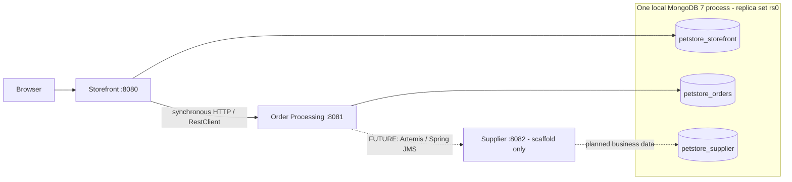

# Java Pet Store modernization

## Project overview

An incremental modernization of **Java Pet Store 1.3.1_02** using **Java 21, Spring Boot 4.1.1, and MongoDB 7**. MongoDB was an optional stretch goal in the challenge and is implemented.

The original application was exercised and inspected before migrating vertical slices. The current customer flow is implemented: registration/sign-in, catalog browsing/search, session cart, authenticated checkout, and order confirmation. Order creation ends at **PENDING**; approval and fulfilment are not implemented.

## Architecture

| Service | Port | Current responsibility |
|---|---:|---|
| Storefront Service | 8080 | Identity/authentication, customer/account, catalog/search, anonymous session cart, checkout orchestration, Thymeleaf UI |
| Order Processing Service | 8081 | Immutable order snapshots, synchronous `POST /api/orders`, validation, total calculation, initial `PENDING` persistence |
| Supplier Service | 8082 | Bootstrap and service boundary only; supplier/inventory business flow is a next migration slice |



Solid arrows show implemented communication. Dashed arrows are **future work**, not an installed broker or working supplier flow. Services have no Java/Maven dependencies on one another and do not access each other's repositories or databases. See [target architecture](docs/06-target-architecture.md).

## Repository structure

```text
petstore-modernized/
├── pom.xml                       # Parent/aggregator: Boot management, Java 21
├── mvnw, mvnw.cmd, .mvn/          # Maven wrapper
├── compose.yaml                  # One MongoDB 7 container
├── storefront-service/           # pom.xml + existing application/resources/tests
├── order-processing-service/     # pom.xml + order creation API/tests
├── supplier-service/             # pom.xml + bootstrap/startup test
└── docs/
```

## Prerequisites

- Java 21 (`java -version`; configure `JAVA_HOME` accordingly)
- Docker and Docker Compose
- Maven wrapper included; no separate Maven installation required
- Available local ports 27017, 8080, 8081, and 8082

Commands below run from the repository root. Windows users can use `mvnw.cmd`.

## Start MongoDB

```sh
docker compose up -d mongodb
```

Compose runs **one MongoDB 7 container**, with a named data volume and `--replSet rs0`. The single-node replica set supports local Mongo transaction semantics; it is not a high-availability deployment.

On a **fresh data volume**, inspect replica-set state:

```sh
docker compose exec mongodb mongosh --quiet --eval 'rs.status()'
```

If it reports that the replica set is not initialized, initialize it once:

```sh
docker compose exec mongodb mongosh --quiet --eval 'rs.initiate({_id:"rs0",members:[{_id:0,host:"localhost:27017"}]})'
```

Check readiness before starting services/tests:

```sh
docker compose exec mongodb mongosh --quiet --eval 'db.hello().isWritablePrimary'
```

Wait for `true`. The Compose ping health check alone does not establish replica-set readiness. Existing initialized volumes retain their configuration; do not reinitialize them. These hostnames assume the Java services run on the host, as below.

## Build

With MongoDB running and `rs0` ready:

```sh
./mvnw clean verify
```

The root reactor builds all three executable service JARs. The current suite contains **215 tests**: 141 Storefront, 53 Order Processing, and 21 Supplier. Tests need local MongoDB access; the test JVM also needs normal agent-attachment support for Mockito.

## Artemis checkpoint startup

Order Processing now also needs the local broker for order publication:

```sh
docker compose up -d artemis
docker compose logs -f artemis
```

The pinned `apache/artemis:2.57.0-alpine` image exposes messaging on localhost:61616 and its console on http://localhost:8161. The heap is 128–256 MiB; broker data is in `petstore-artemis-data`. Local defaults are `ARTEMIS_USER=petstore` and `ARTEMIS_PASSWORD=petstore-dev`; set the same environment variables for Compose and Order Processing to override them. Existing broker volumes retain the credentials created at first startup. `ARTEMIS_BROKER_URL` and `ORDER_SUBMITTED_DESTINATION` can override the application connection and queue (`petstore.order.submitted`).

This checkpoint adds asynchronous automatic approval after PENDING persistence. The architecture/parity documents below describe the preceding checkpoint and await their planned broader refresh. A failed JMS send leaves the order persisted as PENDING but fails the POST, so a retry can create another order. There is no outbox or automatic publication recovery. The transacted listener relies on Artemis redelivery (default maximum 10 attempts, no delay, generated DLQ configuration); no custom DLQ processor is implemented. Tests mock the sender and stop listeners, so the regular Maven suite does not require Artemis.

## Supplier fulfilment checkpoint

Supplier now consumes `petstore.inventory.requested` and publishes `petstore.inventory.fulfilled`. Both services configure these through `INVENTORY_REQUESTED_DESTINATION` / `INVENTORY_FULFILLED_DESTINATION`; Storefront has no JMS dependency. Fulfilment results add a stable `eventId` to the shipped-lines contract for persisted deduplication. The older architecture/parity documents await their planned refresh.

With MongoDB/Artemis running, start Supplier alongside Order Processing:

```sh
./mvnw -pl supplier-service spring-boot:run
curl http://localhost:8082/api/inventory
curl http://localhost:8082/api/inventory/EST-2
curl -X PUT http://localhost:8082/api/inventory/EST-2 \
  -H 'Content-Type: application/json' -d '{"quantity":25}'
```

PUT **sets** current stock to the supplied nonnegative integer; it does not add stock. Positive stock triggers pending-order retries, so the response shows stock **after** allocation. Unknown IDs return 404. `POST /api/inventory/retry-pending` explicitly retries outstanding lines without changing stock. These are unauthenticated local/internal operational APIs; access control is deferred. Use isolated demo data or record/restore stock when testing shortages.

The legacy seed resource contains EST-1 through EST-29 at 10000 each; only missing IDs are initialized on restart. Stock deductions, shipped quantities and shipment history commit in one Supplier Mongo transaction. Each pass ships full available lines and leaves unavailable lines pending. Order Processing derives `SHIPPED_PART` / `COMPLETED` from cumulative quantities, not the event's `complete` hint.

JMS publication is outside Mongo transactions: a failed inventory-request send leaves APPROVED; a failed fulfilment-result send leaves Supplier deductions and shipment history committed. Duplicate delivery never re-deducts stock. There is **no automatic resend/outbox**: these gaps require replay/reconciliation. A missing result must be replayed with its original persisted shipment event ID and lines. Retrying pending orders alone does not republish old shipment passes.

## Manual admin checkpoint

Storefront now protects `/admin/**` and `/api/admin/**` with `ROLE_ADMIN`; approve/deny and logout require CSRF. Order Processing's matching `/api/admin/orders` list/detail/approve/deny APIs remain internal and unauthenticated; service-to-service access control is a later hardening concern. The older architecture/parity sections await their broader refresh.

Before starting Storefront, configure `PETSTORE_ADMIN_USERNAME` and `PETSTORE_ADMIN_PASSWORD` in its IntelliJ run environment, or enter them without putting the password in shell history (Bash/Zsh):

```sh
printf 'Admin username: '
read -r PETSTORE_ADMIN_USERNAME
printf 'Admin password: '
read -rs PETSTORE_ADMIN_PASSWORD
printf '\n'
export PETSTORE_ADMIN_USERNAME PETSTORE_ADMIN_PASSWORD
./mvnw -pl storefront-service spring-boot:run
```

If either value is blank, bootstrap does nothing. A new username receives an enabled ADMIN user with a BCrypt hash and no Customer document. Existing usernames are left unchanged, including roles/passwords; choose a new username rather than expecting bootstrap to promote an existing customer. Registration cannot select ADMIN.

With MongoDB, Artemis and all three services running:

1. Sign in as a customer at http://localhost:8080. Use fictitious account/payment data.
2. In `en-US`, add EST-1 and set quantity to **31**: at the seeded price 16.50, checkout totals **511.50**. Automatic approval leaves this order PENDING.
3. Logout, then sign in with the configured admin credentials. Login opens `/admin/orders`, filtered to PENDING.
4. Click **Approve**. The shared approval service transitions once to APPROVED and requests Supplier inventory. Refresh with the appropriate status filter (or All) to see SHIPPED_PART/COMPLETED according to available stock.
5. Create another 511.50 customer order, return as admin, and click **Deny**. It becomes DENIED without an inventory request. Duplicate/competing decisions return 409; the UI refreshes the list.

The browser uses only Storefront. Admin responses contain identity/date/locale/status/amount and safe line information, without contacts or payment data. Customers cannot access admin pages/APIs and do not see admin navigation. Admin navigation includes Orders, Shop and Logout; no customer Account is required.

Downstream failures return a controlled 502 through Storefront. If APPROVED persisted before JMS publication failed, it remains APPROVED; refresh before retrying. Replay/reconciliation is still required for this known publication gap—there is no outbox or rollback to PENDING.

## Supplier browser tools

Set `PETSTORE_SUPPLIER_USERNAME` and `PETSTORE_SUPPLIER_PASSWORD` in Storefront's run environment before startup. Blank/incomplete configuration does nothing. A new username receives an enabled SUPPLIER user with a BCrypt hash and no Customer record; reruns never overwrite existing users or promote their roles. Do not commit credentials.

Supplier login opens http://localhost:8080/supplier/inventory. The Inventory page filters item IDs and **sets exact stock**, displaying Supplier's returned quantity after allocation. `/supplier/orders` shows pending/completed line progress and shipment history, with a CSRF-protected retry button. Positive inventory updates already retry pending work automatically.

Only ROLE_SUPPLIER can use these pages/proxy APIs; ADMIN alone cannot. Multi-role login precedence is ADMIN → SUPPLIER → Shop. The browser talks only to Storefront; `PETSTORE_SUPPLIER_BASE_URL` defaults to `http://localhost:8082` for the server-side HTTP client. Supplier's direct operational APIs remain internal and unauthenticated in this demo.

To demonstrate partial fulfilment, set EST-15 to 0, checkout an en-US customer cart with EST-1 ×1 and EST-15 ×1, and inspect the pending Supplier order. Set EST-15 to 10: its remaining line ships, the returned stock becomes 9 for that single waiting unit, and the order becomes COMPLETED. More waiting orders may consume additional stock. Use demo stock and restore it afterward if needed.

## Run services

Run each command in a separate terminal:

```sh
./mvnw -pl order-processing-service spring-boot:run
./mvnw -pl storefront-service spring-boot:run
./mvnw -pl supplier-service spring-boot:run
```

Supplier can start independently but is not needed for the current checkout demo. Alternatively, import the root `pom.xml` into IntelliJ, select Java 21, and run each module's application class.

Open **http://localhost:8080**. `/` redirects to `/shop`. The browser talks only to Storefront; it never needs to visit port 8081. Order Processing and Supplier have no browser home pages, so `/` on ports 8081/8082 can legitimately return 404.

Storefront's HTTP client configuration is in its `application.properties`:

```properties
petstore.order-processing.base-url=http://localhost:8081
petstore.order-processing.connect-timeout=3s
petstore.order-processing.read-timeout=5s
```

## Demo journey

1. Register through `/register`, then sign in. Login navigates to Shop. Use fictitious demo contact/payment data, not real card details.
2. Browse FISH → Angelfish, or search for a product. Locale selection supports `en-US`, `ja-JP`, and `zh-CN`.
3. Add EST-1 to the cart. Adding the same item again resets its quantity to 1.
4. Open Cart and update the quantity. Zero/negative quantities remove the item.
5. Proceed to Checkout. Browsing/cart work anonymously; checkout requires sign-in. The cart survives login, after which you can return through Shop/Cart.
6. Review the summary and prefilled billing/shipping contacts. Edit shipping independently if needed. Checkout derives payment display data from the saved account, so saved card type and last4 metadata are required for this demo; the checkout form never requests them.
7. Submit and see the generated order ID, timestamp, total, and **PENDING** status. Open Cart to confirm it is empty.

If Order Processing is unavailable, checkout fails and the session cart stays intact. The UI displays: “Order processing is temporarily unavailable. Your cart has been kept.” It does not expose downstream exception bodies. [Order flow and failure boundaries](docs/07-order-processing.md) describe the exact behavior.

## Databases and catalog data

| Logical database | Owner | Current data |
|---|---|---|
| `petstore_storefront` | Storefront | Users, customers, categories, products, items; cart is session-only |
| `petstore_orders` | Order Processing | Order snapshots |
| `petstore_supplier` | Supplier | Configured ownership only; no inventory/domain collections yet |

One Mongo process hosts these logical databases locally. MongoDB creates databases/collections when needed; an unused Supplier database may not yet appear in listings. No service reads another service's database. Data from an older `petstore` database is not automatically migrated.

Storefront seeds `src/main/resources/legacy/catalog.xml` within its module, extracted from the original legacy `<Catalog>` section only. No legacy Users, Customers, passwords, or payment data were copied. The resource contains 5 categories, 16 products, and 28 items, with 15/48/83 embedded localized details respectively.

The seeder validates before transactional insertion and **skips if any catalog data already exists**, including a partial catalog. It does not wipe data or overwrite edits. Locale resolution is requested locale → `en-US` → first available detail. EST-15 deliberately lacks Japanese item details. Search is case-insensitive, uses all whitespace-separated tokens, and searches locale-resolved product text/category IDs and associated item descriptions.

## Security

- Spring Security with server-side HTTP sessions and BCrypt password hashes; no JWT/distributed session authentication was introduced.
- Account and checkout require authentication. Catalog and cart are public.
- CSRF remains enabled for account updates, cart mutations, checkout, and logout. Registration/login endpoints retain their existing explicit CSRF exemptions.
- Thymeleaf provides CSRF tokens to the vanilla JavaScript pages. Account ownership resolves from the authenticated user, never a browser-supplied customer ID.
- Only `cardType` and `last4` cross Storefront → Order Processing. Raw PAN/CVV are not part of the order contract.
- **Display metadata only:** Storefront accepts full card numbers transiently to derive last4, and persists only cardType, last4 and expiryDate. Blank account input preserves last4. No payment authorization or tokenization is performed, and no PCI-compliance claim is made. On startup, an idempotent Mongo update pipeline removes legacy account.creditCard.cardNumber fields and derives last4 where valid, without reading PAN into application memory. Invalid legacy values are removed without inventing metadata; re-enter valid metadata if checkout rejects it.
- Order Processing is an internal backend API without browser-session authentication; production service-to-service access controls are not demonstrated here.

## Testing

The suite covers registration/authentication, registration transaction rollback, account ownership, catalog parsing/seeding and locale behavior, cart session isolation, CSRF/security, checkout HTTP failures, order validation/persistence, and MVC/template integration. Checkout HTTP tests use `MockRestServiceServer`; they do not require a running Order Processing process. Dedicated catalog/cart/checkout/order test classes use isolated Mongo databases; existing account tests clean up their test records.

Page tests cover public/protected routes, rendered CSRF tokens, and anonymous-cart retention through real login. A separate headless Chrome smoke check exercised the customer UI with mocked APIs; it is not a live end-to-end distributed-system test or part of the Maven test count.

## Deferred / next work

- ActiveMQ Artemis + Spring JMS integration
- Asynchronous order processing and automatic approval
- Supplier inventory, allocation, replenishment, and fulfilment
- Manual/admin approval and admin APIs/UI
- Order completion and order history/query UI
- Real payment-provider integration, if required later (not implemented)

The lifecycle enum includes later states, but only `PENDING` is currently created. No broker, JMS publisher/listener, approval rule, supplier call, or inventory workflow is implemented.

## Further reading

- [Verified legacy system](docs/01-legacy-system-overview.md)
- [Implemented account/authentication flow](docs/02-account-auth-flow.md)
- [Legacy defects and modernization status](docs/03-legacy-defects.md)
- [Functional parity](docs/04-functional-parity.md)
- [AI assistance and human decisions](docs/05-ai-usage.md)
- [Target architecture: current and planned](docs/06-target-architecture.md)
- [Synchronous order processing](docs/07-order-processing.md)
