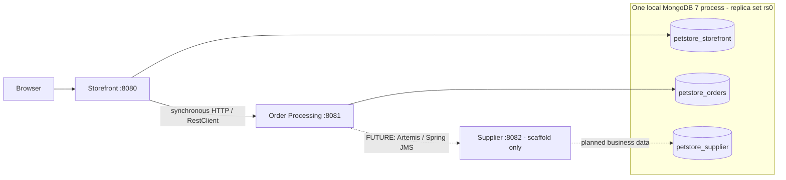

# Java Pet Store modernization

## Project overview

An incremental modernization of **Java Pet Store 1.3.1_02** using **Java 21, Spring Boot 4.1.1, and MongoDB 7**. MongoDB was an optional stretch goal in the challenge and is implemented.

The original application was exercised and inspected before migrating vertical slices. The current customer flow is implemented: registration/sign-in, catalog browsing/search, session cart, authenticated checkout, and order confirmation. Order creation ends at **PENDING**; approval and fulfilment are not implemented.

## Architecture

| Service | Port | Current responsibility |
|---|---:|---|
| Storefront Service | 8080 | Identity/authentication, customer/account, catalog/search, anonymous session cart, checkout orchestration, Thymeleaf UI |
| Order Processing Service | 8081 | Immutable order snapshots, synchronous `POST /api/orders`, validation, total calculation, initial `PENDING` persistence |
| Supplier Service | 8082 | Bootstrap and service boundary only; supplier/inventory business flow is a next migration slice |



Solid arrows show implemented communication. Dashed arrows are **future work**, not an installed broker or working supplier flow. Services have no Java/Maven dependencies on one another and do not access each other's repositories or databases. See [target architecture](docs/06-target-architecture.md).

## Repository structure

```text
petstore-modernized/
├── pom.xml                       # Parent/aggregator: Boot management, Java 21
├── mvnw, mvnw.cmd, .mvn/          # Maven wrapper
├── compose.yaml                  # One MongoDB 7 container
├── storefront-service/           # pom.xml + existing application/resources/tests
├── order-processing-service/     # pom.xml + order creation API/tests
├── supplier-service/             # pom.xml + bootstrap/startup test
└── docs/
```

## Prerequisites

- Java 21 (`java -version`; configure `JAVA_HOME` accordingly)
- Docker and Docker Compose
- Maven wrapper included; no separate Maven installation required
- Available local ports 27017, 8080, 8081, and 8082

Commands below run from the repository root. Windows users can use `mvnw.cmd`.

## Start MongoDB

```sh
docker compose up -d mongodb
```

Compose runs **one MongoDB 7 container**, with a named data volume and `--replSet rs0`. The single-node replica set supports local Mongo transaction semantics; it is not a high-availability deployment.

On a **fresh data volume**, inspect replica-set state:

```sh
docker compose exec mongodb mongosh --quiet --eval 'rs.status()'
```

If it reports that the replica set is not initialized, initialize it once:

```sh
docker compose exec mongodb mongosh --quiet --eval 'rs.initiate({_id:"rs0",members:[{_id:0,host:"localhost:27017"}]})'
```

Check readiness before starting services/tests:

```sh
docker compose exec mongodb mongosh --quiet --eval 'db.hello().isWritablePrimary'
```

Wait for `true`. The Compose ping health check alone does not establish replica-set readiness. Existing initialized volumes retain their configuration; do not reinitialize them. These hostnames assume the Java services run on the host, as below.

## Build

With MongoDB running and `rs0` ready:

```sh
./mvnw clean verify
```

The root reactor builds all three executable service JARs. The current suite contains **127 tests**: 94 Storefront, 32 Order Processing, and 1 Supplier. Tests need local MongoDB access; the test JVM also needs normal agent-attachment support for Mockito.

## Artemis checkpoint startup

Order Processing now also needs the local broker for order publication:

```sh
docker compose up -d artemis
docker compose logs -f artemis
```

The pinned `apache/artemis:2.57.0-alpine` image exposes messaging on localhost:61616 and its console on http://localhost:8161. The heap is 128–256 MiB; broker data is in `petstore-artemis-data`. Local defaults are `ARTEMIS_USER=petstore` and `ARTEMIS_PASSWORD=petstore-dev`; set the same environment variables for Compose and Order Processing to override them. Existing broker volumes retain the credentials created at first startup. `ARTEMIS_BROKER_URL` and `ORDER_SUBMITTED_DESTINATION` can override the application connection and queue (`petstore.order.submitted`).

This checkpoint adds asynchronous automatic approval after PENDING persistence. The architecture/parity documents below describe the preceding checkpoint and await their planned broader refresh. A failed JMS send leaves the order persisted as PENDING but fails the POST, so a retry can create another order. There is no outbox or automatic publication recovery. The transacted listener relies on Artemis redelivery (default maximum 10 attempts, no delay, generated DLQ configuration); no custom DLQ processor is implemented. Tests mock the sender and stop listeners, so the regular Maven suite does not require Artemis.

## Run services

Run each command in a separate terminal:

```sh
./mvnw -pl order-processing-service spring-boot:run
./mvnw -pl storefront-service spring-boot:run
./mvnw -pl supplier-service spring-boot:run
```

Supplier can start independently but is not needed for the current checkout demo. Alternatively, import the root `pom.xml` into IntelliJ, select Java 21, and run each module's application class.

Open **http://localhost:8080**. `/` redirects to `/shop`. The browser talks only to Storefront; it never needs to visit port 8081. Order Processing and Supplier have no browser home pages, so `/` on ports 8081/8082 can legitimately return 404.

Storefront's HTTP client configuration is in its `application.properties`:

```properties
petstore.order-processing.base-url=http://localhost:8081
petstore.order-processing.connect-timeout=3s
petstore.order-processing.read-timeout=5s
```

## Demo journey

1. Register through `/register`, then sign in. Login navigates to Shop. Use fictitious demo contact/payment data, not real card details.
2. Browse FISH → Angelfish, or search for a product. Locale selection supports `en-US`, `ja-JP`, and `zh-CN`.
3. Add EST-1 to the cart. Adding the same item again resets its quantity to 1.
4. Open Cart and update the quantity. Zero/negative quantities remove the item.
5. Proceed to Checkout. Browsing/cart work anonymously; checkout requires sign-in. The cart survives login, after which you can return through Shop/Cart.
6. Review the summary and prefilled billing/shipping contacts. Edit shipping independently if needed. Checkout derives payment display data from the saved account, so a saved card type and number are required for this demo; the checkout form never requests them.
7. Submit and see the generated order ID, timestamp, total, and **PENDING** status. Open Cart to confirm it is empty.

If Order Processing is unavailable, checkout fails and the session cart stays intact. The UI displays: “Order processing is temporarily unavailable. Your cart has been kept.” It does not expose downstream exception bodies. [Order flow and failure boundaries](docs/07-order-processing.md) describe the exact behavior.

## Databases and catalog data

| Logical database | Owner | Current data |
|---|---|---|
| `petstore_storefront` | Storefront | Users, customers, categories, products, items; cart is session-only |
| `petstore_orders` | Order Processing | Order snapshots |
| `petstore_supplier` | Supplier | Configured ownership only; no inventory/domain collections yet |

One Mongo process hosts these logical databases locally. MongoDB creates databases/collections when needed; an unused Supplier database may not yet appear in listings. No service reads another service's database. Data from an older `petstore` database is not automatically migrated.

Storefront seeds `src/main/resources/legacy/catalog.xml` within its module, extracted from the original legacy `<Catalog>` section only. No legacy Users, Customers, passwords, or payment data were copied. The resource contains 5 categories, 16 products, and 28 items, with 15/48/83 embedded localized details respectively.

The seeder validates before transactional insertion and **skips if any catalog data already exists**, including a partial catalog. It does not wipe data or overwrite edits. Locale resolution is requested locale → `en-US` → first available detail. EST-15 deliberately lacks Japanese item details. Search is case-insensitive, uses all whitespace-separated tokens, and searches locale-resolved product text/category IDs and associated item descriptions.

## Security

- Spring Security with server-side HTTP sessions and BCrypt password hashes; no JWT/distributed session authentication was introduced.
- Account and checkout require authentication. Catalog and cart are public.
- CSRF remains enabled for account updates, cart mutations, checkout, and logout. Registration/login endpoints retain their existing explicit CSRF exemptions.
- Thymeleaf provides CSRF tokens to the vanilla JavaScript pages. Account ownership resolves from the authenticated user, never a browser-supplied customer ID.
- Only `cardType` and `last4` cross Storefront → Order Processing. Raw PAN/CVV are not part of the order contract.
- **Outstanding:** Storefront customer persistence still stores the raw card number. Account responses omit it, but storage hardening/tokenization is not implemented. This demo makes no PCI-compliance or production-readiness claim.
- Order Processing is an internal backend API without browser-session authentication; production service-to-service access controls are not demonstrated here.

## Testing

The suite covers registration/authentication, registration transaction rollback, account ownership, catalog parsing/seeding and locale behavior, cart session isolation, CSRF/security, checkout HTTP failures, order validation/persistence, and MVC/template integration. Checkout HTTP tests use `MockRestServiceServer`; they do not require a running Order Processing process. Dedicated catalog/cart/checkout/order test classes use isolated Mongo databases; existing account tests clean up their test records.

Page tests cover public/protected routes, rendered CSRF tokens, and anonymous-cart retention through real login. A separate headless Chrome smoke check exercised the customer UI with mocked APIs; it is not a live end-to-end distributed-system test or part of the Maven test count.

## Deferred / next work

- ActiveMQ Artemis + Spring JMS integration
- Asynchronous order processing and automatic approval
- Supplier inventory, allocation, replenishment, and fulfilment
- Manual/admin approval and admin APIs/UI
- Order completion and order history/query UI
- Payment persistence hardening/tokenization

The lifecycle enum includes later states, but only `PENDING` is currently created. No broker, JMS publisher/listener, approval rule, supplier call, or inventory workflow is implemented.

## Further reading

- [Verified legacy system](docs/01-legacy-system-overview.md)
- [Implemented account/authentication flow](docs/02-account-auth-flow.md)
- [Legacy defects and modernization status](docs/03-legacy-defects.md)
- [Functional parity](docs/04-functional-parity.md)
- [AI assistance and human decisions](docs/05-ai-usage.md)
- [Target architecture: current and planned](docs/06-target-architecture.md)
- [Synchronous order processing](docs/07-order-processing.md)
