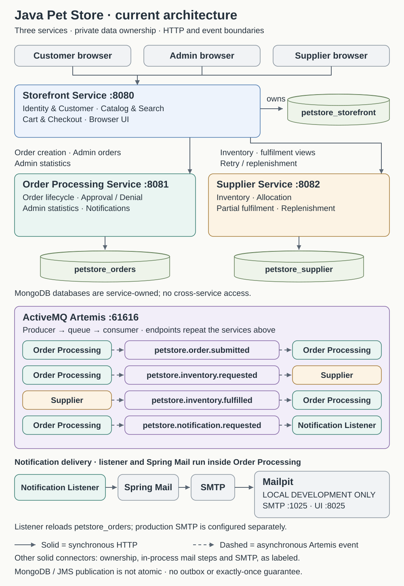

# Java Pet Store modernization

This project modernizes Java Pet Store 1.3.1_02 with Java 21, Spring Boot and MongoDB. It preserves verified legacy business outcomes while replacing EJB/CMP/JSP infrastructure with service-owned MongoDB aggregates, Thymeleaf, synchronous HTTP APIs and ActiveMQ Artemis messaging. Deliberate behavior changes are documented rather than presented as exact parity.

## Architecture and stack



| Service | Port | Responsibilities | MongoDB database |
| --- | --- | --- | --- |
| Storefront Service | 8080 | Authentication, Account, catalog, session cart, checkout and customer/Admin/Supplier browser interfaces | `petstore_storefront` |
| Order Processing Service | 8081 | Order snapshots, approval/denial, fulfilment progress, Admin statistics and customer notifications | `petstore_orders` |
| Supplier Service | 8082 | Inventory, allocation, shipment history and replenishment | `petstore_supplier` |

The checked-in stack uses **Java 21, Spring Boot 4.1.1, MongoDB 7.0, Artemis 2.57.0-alpine and Mailpit v1.27.8**. The Maven Wrapper supplies Maven. One local MongoDB process hosts the three logical databases as a single-node `rs0` replica set for transactions; this is not production HA.

See the [canonical architecture and legacy-to-MongoDB mapping](docs/06-target-architecture.md#canonical-current-state-architecture) and [detailed checkout, lifecycle and notification workflows](docs/07-order-processing.md).

Browser application traffic uses **http://localhost:8080**. Services have no cross-service repository access or shared Java domain dependencies. Mailpit and the Artemis console are separate infrastructure interfaces.

## Engineering approach

The migration followed the legacy Storefront, OPC and Supplier domain boundaries through bounded vertical slices, resulting in three independently deployable services. [Legacy findings](docs/01-legacy-system-overview.md), [corrected defects](docs/03-legacy-defects.md) and the [parity record](docs/04-functional-parity.md) distinguish preserved outcomes from deliberate changes.

[Architecture rationale](docs/06-target-architecture.md#legacy-persistence-to-mongodb-aggregates) explains service-owned aggregates, transactional registration/fulfilment, atomic stock allocation, optimistic concurrency, event-ID guards and MongoDB aggregation/paging. [Order processing](docs/07-order-processing.md) documents HTTP/JMS failure boundaries; [verification](docs/09-functional-verification.md) covers the browser flows. [AI usage](docs/05-ai-usage.md) records assistance and developer decisions.

## Implemented capabilities

- Transactional registration, BCrypt passwords, Spring Security sessions, CSRF-protected mutations, Account updates and role-separated operational interfaces.
- Customer Storefront and JavaScript messages in en-US, ja-JP and zh-CN. An explicit locale choice overrides the saved profile preference for display; saving the Account form updates the preference. Admin/Supplier consoles remain English.
- Legacy catalog data: 5 categories, 16 products and 28 items with embedded localized details. Fallback is requested locale → en-US → first available detail, independently for each Product/Item.
- MongoDB-native Product-level search requiring **all** normalized tokens; database-side filtering, sorting, counting and pagination. This deliberately differs from legacy Item-oriented, effectively **any**-token search.
- Product/Item listing pagination, category-specific presentation fallbacks, and `/shop/items/{itemId}` Item Detail pages. All catalog prices displayed to customers use `listPrice`.
- Session carts store only IDs and quantities. Add sets quantity to 1; nonpositive updates remove an item. Checkout derives identity, quantities and prices server-side and clears the cart only after a valid downstream 201 response.
- PENDING → APPROVED → SHIPPED_PART/COMPLETED, or PENDING → DENIED. Automatic approval uses strict en-US totals below 500 and ja-JP totals below 50000; zh-CN and other policy locales remain pending for Admin decisions.
- Supplier-owned inventory, conditional whole-line allocation, partial fulfilment, persisted shipment passes and automatic retry after positive stock updates. Seed inventory is 10000 for EST-1 through EST-29.
- Admin order list/detail, status filters and atomic approve/deny; date-filtered MongoDB sales statistics with a revenue donut and units-sold bars. Statistics deliberately include every workflow status and are not recognized accounting revenue.
- Localized customer approval, denial, shipment-pass and completion emails. Identifier-only notification events go through Artemis; the Order Processing listener reloads the authoritative Order before Spring Mail delivery. `NOTIFICATION_ENABLED` defaults to `true`; Mailpit catches email locally.

## Getting started

Follow the [installation guide](docs/08-installation-and-setup.md) for [Windows PowerShell](docs/08-installation-and-setup.md#windows-1011-with-powershell) or [macOS Terminal](docs/08-installation-and-setup.md#macos), then the [functional-verification guide](docs/09-functional-verification.md). Neither path requires an IDE or a separately installed Maven, MongoDB, Artemis or Mailpit.

The guide covers prerequisites, Docker startup, one-time MongoDB replica-set initialization, `clean verify`, and the three terminal-only service commands.

Local credentials, service commands and infrastructure URLs are documented in the [installation guide](docs/08-installation-and-setup.md#environment-and-demo-accounts). Log out before switching roles; ADMIN does not imply SUPPLIER.

## Testing

Run `./mvnw clean verify` on macOS or `.\mvnw.cmd clean verify` in Windows PowerShell with a writable local MongoDB `rs0`. Automated tests use isolated databases and mock or isolate SMTP/JMS/downstream HTTP boundaries where applicable. They do not require manual browser interaction or Mailpit delivery.

Last verified on **2026-09-20 against the local workspace**, including uncommitted implementation changes: `./mvnw clean verify` completed with **BUILD SUCCESS — 282 tests** (180 Storefront, 81 Order Processing, 21 Supplier), zero failures/errors/skips. All **51 JavaScript presentation tests** also passed.

Optional JavaScript presentation checks use Node.js’s built-in runner: `node --test storefront-service/src/test/js/*.test.cjs`. They are separate from Maven and require no npm dependencies.

Tests cover security/CSRF, registration rollback, raw-BSON payment hardening, locale fallback, MongoDB search/paging, Item Detail, accessible catalog fallbacks, cart and checkout failures, concurrent decisions/allocation, fulfilment event IDs, notifications and Admin statistics. Use the functional guide for independent browser verification; an automated build does not validate a clean-machine installation.

## Payment treatment and reliability limits

Full card numbers are transient write-only input. Customer documents persist only `cardType`, `last4` and `expiryDate`; orders receive only type and last4. The Account API never returns `cardNumber`. The page displays a masked saved payment method and leaves the replacement input blank. Blank replacement preserves last4. Startup migration removes legacy raw-number fields. No payment authorization, tokenization or PCI-compliance claim is made.

MongoDB commits and JMS publication are not atomic. There is no transactional outbox or automatic reconciliation; lost publications remain possible. Duplicate-safe business consumers do not provide exactly-once processing. Email is best-effort: SMTP failure does not undo business state, while redelivery can duplicate an email. Checkout has no request-level idempotency key, so a lost acknowledgement can lead to a duplicate order on retry.

Production hardening still requires backend service authentication/TLS, secrets management, MongoDB/Artemis HA, recovery procedures and production monitoring. Favorite Category, My List, the favorite-category banner and remember-username cookie remain deferred. Legacy JAX-RPC/JWSDP transport and old page chrome are intentionally excluded.

## Repository and documentation

```text
storefront-service/          # customer and operational browser interfaces
order-processing-service/    # orders, statistics and notifications
supplier-service/            # inventory and fulfilment
docs/                        # architecture, setup, parity and verification
compose.yaml                 # local MongoDB, Artemis and Mailpit
pom.xml, mvnw, mvnw.cmd       # Maven reactor and wrapper
```

1. [Legacy system overview](docs/01-legacy-system-overview.md)
2. [Account and authentication](docs/02-account-auth-flow.md)
3. [Legacy defects and risks](docs/03-legacy-defects.md)
4. [Functional parity](docs/04-functional-parity.md)
5. [AI usage](docs/05-ai-usage.md)
6. [Target architecture](docs/06-target-architecture.md)
7. [Order processing](docs/07-order-processing.md)
8. [Installation and setup](docs/08-installation-and-setup.md)
9. [Functional verification](docs/09-functional-verification.md)

[Third-party notices](THIRD_PARTY_NOTICES.md)
