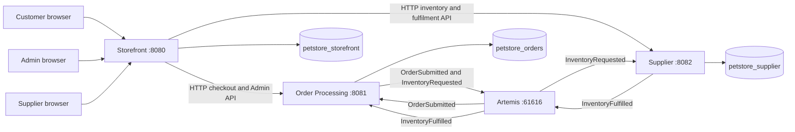

# Current target architecture

## Principles and service boundaries

Migration was incremental and strangler-style: verify a legacy vertical slice, preserve its business outcome, replace obsolete mechanisms, then test before proceeding. This is a migration approach, not a claim of a deployed legacy/modern routing gateway.

Three deployables follow meaningful legacy Storefront / OPC / Supplier boundaries. Features within a service are packages, not additional microservices. There are no shared Mongo entities, cross-service repository calls or service-to-service Maven dependencies. Each service owns its DTOs and database.

| Service | Responsibilities | Database |
|---|---|---|
| Storefront :8080 | Identity, account, catalog, session cart, checkout, customer/Admin/Supplier browser UI and operational HTTP proxies | `petstore_storefront` |
| Order Processing :8081 | Order snapshots, total calculation, approval/denial and fulfilment lifecycle | `petstore_orders` |
| Supplier :8082 | Inventory, allocation, pending fulfilments, shipment history and replenishment | `petstore_supplier` |

## Implemented communication

Browsers interact only with Storefront. RestClient provides synchronous acknowledgement for checkout and operational requests, with configurable URLs and timeouts. ROLE_ADMIN and ROLE_SUPPLIER protect their respective Storefront pages/proxies; CSRF protects mutations. Backend operational APIs are internal and do not yet have service-to-service authentication/TLS.

JMS queues are `petstore.order.submitted`, `petstore.inventory.requested`, and `petstore.inventory.fulfilled`. Messages contain only workflow identifiers and required fulfilment quantities, never customer contacts or payment data. Spring JMS transacted listener sessions acknowledge successful processing; thrown failures use broker redelivery semantics. There is no custom DLQ tooling.

## Data and transaction boundaries

Storefront owns `users`, `customers`, `categories`, `products`, and `items`. Localized catalog details are embedded; session carts store IDs/quantities rather than persisted snapshots. Registration commits users/customers in one Mongo transaction. Catalog seed data excludes legacy users/payment details.

Order Processing owns `orders`: immutable order-time identity/contact/line/payment snapshots plus mutable workflow progress. BigDecimal money is stored as Decimal128. Supplier owns `inventory` and `supplierOrders`, including shipment-pass history. Supplier commits conditional inventory decrements and fulfilment progress/history in a local Mongo transaction. None of these transactions spans services or JMS.

## Idempotency and concurrent work

- Atomic PENDING-only approval/denial lets one concurrent decision win. Automatic and manual approval reuse `OrderApprovalService`; only its successful transition publishes inventory work.
- Supplier order ID uniqueness and persisted line progress prevent duplicate requests from allocating shipped lines twice. Conditional quantity checks prevent overselling; transactional/version conflicts retry only aborted work.
- Each shipment pass has a stable event ID. Order Processing persists processed IDs with shipped quantities and uses optimistic concurrency to prevent duplicate fulfilment application.
- Status is derived from cumulative line progress. PENDING/DENIED orders cannot be completed by inappropriate inventory messages.

## Failure boundaries and known gaps

Storefront clears the cart only after validating a downstream 201 response. Timeouts, connection failures, invalid responses and downstream errors preserve it. An acknowledgement can be lost after persistence, so checkout retry can create another order; request-level idempotency is not implemented.

Mongo writes precede JMS publication. A send failure leaves the committed PENDING order, APPROVED decision, or Supplier shipment intact. There is no transactional outbox. Failed publication needs replay/reconciliation; repeating Supplier allocation does not resend an already recorded shipment automatically. Duplicate-safe consumption is not an exactly-once guarantee. See [order processing](07-order-processing.md).

Storefront stores payment display metadata only and migrates away legacy raw numbers. Orders receive card type/last4 only. There is no payment authorization or PCI-compliance claim.

## Local versus production infrastructure

One MongoDB 7 container hosts three logical databases in a single-node `rs0` replica set, enabling local transactions. One Artemis 2.57.0 broker uses a persistent volume and a 128–256 MB configured heap. Neither setup demonstrates production HA.

Separate clusters could be deployed later without changing ownership. Service authentication/TLS, production secrets, HA deployments, outbox/reconciliation and recovery operations remain hardening work. See [installation](08-installation-and-setup.md) and [functional verification](09-functional-verification.md).
