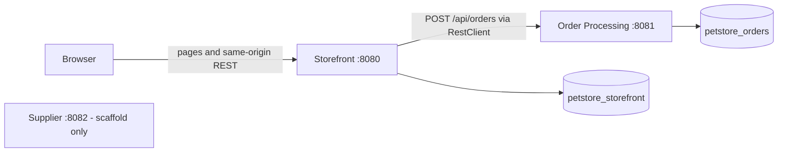
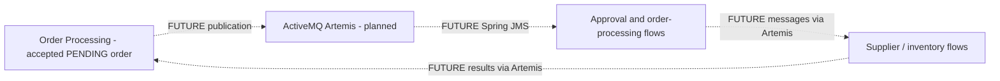

# Target architecture

## Architectural principles

- **Incremental, strangler-style migration:** verify legacy behavior, migrate a bounded vertical slice, and test it before moving forward. This describes migration sequencing; a live routing proxy between legacy and modern systems is not implemented.
- Preserve business outcomes rather than obsolete EJB, CMP, JSP, or MDB mechanisms.
- Use independently deployable service boundaries with explicit database ownership.
- No cross-service repositories, shared Mongo entity modules, or Java/Maven dependencies between services.
- Use synchronous communication where an immediate response is required.
- Preserve the legacy asynchronous business boundary through messaging **when that stage is implemented**.
- Correct confirmed defects deliberately and document remaining gaps.

## Services

| Service | Implemented now | Deferred responsibilities |
|---|---|---|
| Storefront (`:8080`) | Identity/session authentication, account/customer, catalog/search, session cart, checkout orchestration, Thymeleaf UI | Further checkout/payment hardening |
| Order Processing (`:8081`) | Order aggregate, create API, validation, generated ID/time, PENDING persistence, total calculation | Approval, lifecycle transitions, fulfilment orchestration, asynchronous processing |
| Supplier (`:8082`) | Application bootstrap, Mongo configuration, startup test | Inventory, allocation, replenishment, supplier processing |

Supplier's database ownership is configured, but no business data or workflow has been migrated yet.

## Current communication

The browser uses Storefront exclusively. Storefront authenticates checkout and constructs the order-time snapshot. Order Processing validates and persists it, then responds synchronously. HTTP DTOs are local to each service; matching JSON shapes do not create shared Java ownership.

Order Processing is currently an internal API without browser-session authentication. A production service-authentication/authorization scheme is not part of this checkpoint.

## Future async communication — not yet implemented

This is a conceptual boundary, not a finalized queue/topic topology. No broker appears in Compose; no JMS publisher/listener, approval logic, supplier call, or inventory flow exists yet. Message contracts, retries, delivery guarantees, and idempotency remain to be designed and tested.

## Data ownership

| Database | Exclusive service owner | Aggregate/data boundary |
|---|---|---|
| `petstore_storefront` | Storefront | Users, customers, catalog; cart remains in HTTP session |
| `petstore_orders` | Order Processing | Immutable order-time snapshots and initial status |
| `petstore_supplier` | Supplier | Reserved for future supplier/inventory domain data |

An order embeds contacts, display-only payment information, and line snapshots. It does not hold DBRefs to Storefront documents. Monetary values use `BigDecimal`, with explicit Decimal128 persistence for catalog prices and order amounts.

Registration is a Mongo transaction within Storefront's database. Order creation inserts one aggregate within Order Processing's database. There is no distributed transaction across the HTTP boundary.

## Failure boundaries

Storefront retains its cart until Order Processing returns a valid HTTP 201 response with an order ID, timestamp, PENDING status, and matching total. Connection failures, timeouts, downstream 4xx/5xx, malformed responses, and unexpected response values produce a non-sensitive checkout error and preserve the cart.

A timeout or lost response does not prove the remote write failed: Order Processing may already have persisted the order. Cross-request checkout idempotency/reconciliation is not implemented, so retries are not claimed to be exactly-once. See [order processing](07-order-processing.md).

Only card type and last4 cross this boundary. Raw card storage still exists in Storefront and is an outstanding security-hardening item.

## Why three services

The decomposition follows meaningful legacy subsystem/domain boundaries: Storefront, OPC, and Supplier. Identity, customer, catalog, and cart remain cohesive features within Storefront; they are not separate deployables merely because they have separate packages or entities.

Separate service artifacts and local DTOs make ownership explicit without introducing a gateway or shared domain library. Supplier is scaffolded to establish the boundary, not to imply finished supplier behavior.

## Local vs production infrastructure

Locally, one MongoDB 7 container hosts logical databases under a single-node `rs0` replica set. This is a development optimization that enables transaction tests, not evidence of high availability, production scale, or operational readiness.

Separate clusters/deployments could be configured later without changing logical data ownership. Database credentials/isolation, service access controls, TLS, resilience policies, observability operations, and payment storage hardening would need production-specific work. None is implied by this local demo.

For actual startup commands and replica-set initialization, see the [README](../README.md).
