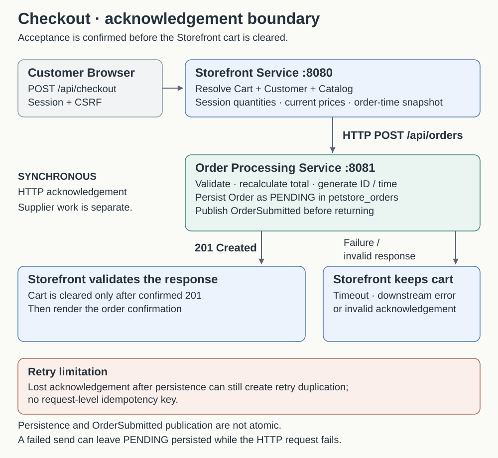
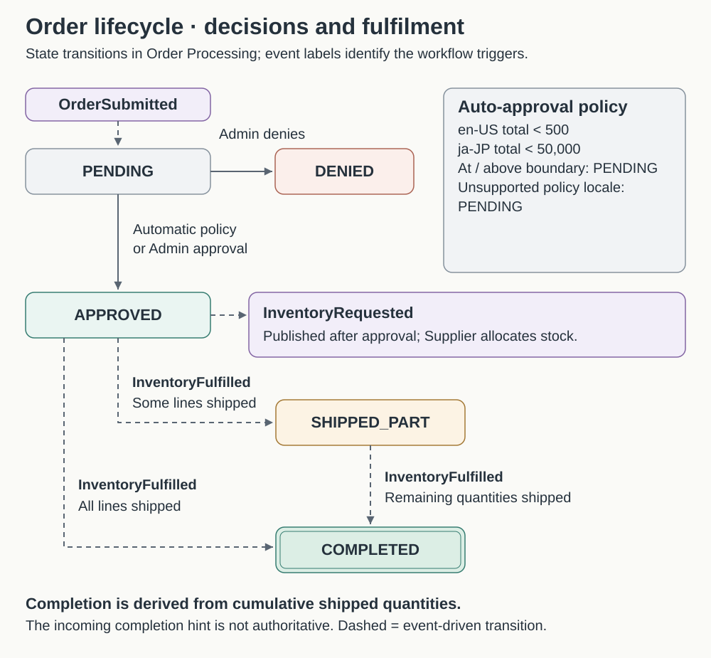
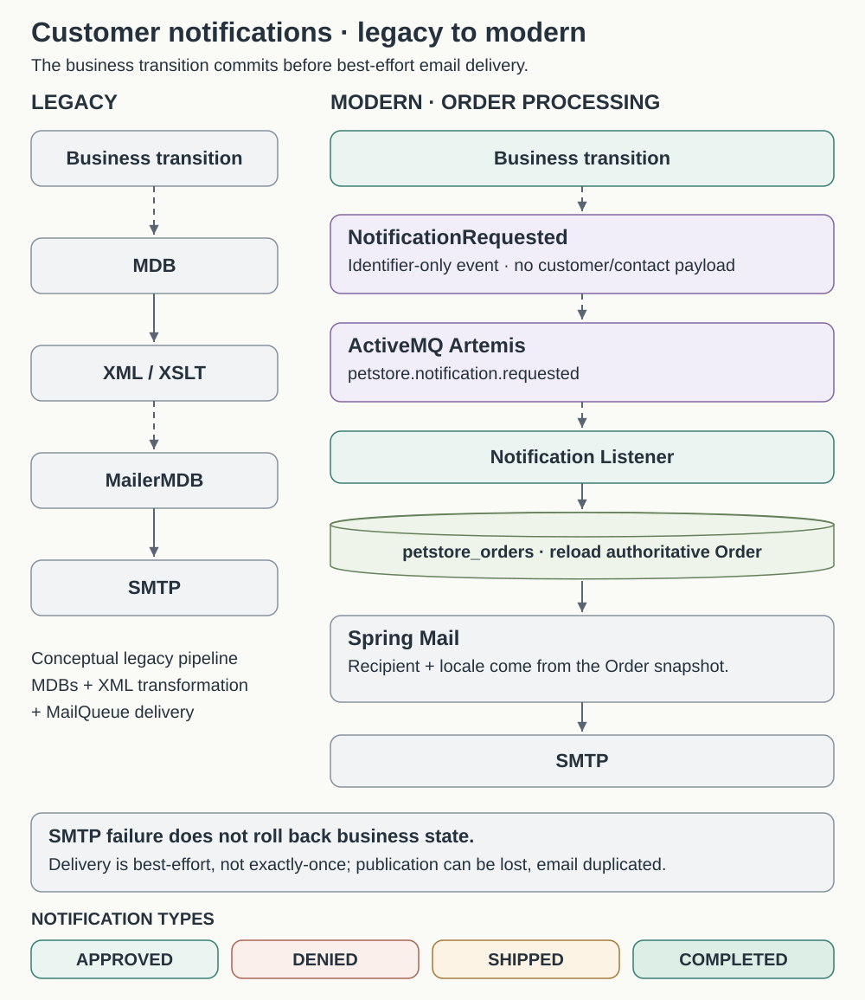

# Order processing and fulfilment

The implemented lifecycle separates order acceptance, approval and fulfilment. Browser application traffic enters through the Storefront Service.

## Synchronous checkout

`POST /api/checkout?locale=en-US` requires authentication and CSRF. The browser supplies `billingInfo` and `shippingInfo` contact snapshots only. The shared locale resolver supplies the effective supported request locale, which becomes Order.locale. Identity/email come from the authenticated User/Customer, quantities from the server session, prices and category/product IDs from current CatalogService results. Sequential line numbers follow deterministic cart order. Catalog fallback remains requested locale → en-US → first detail; EST-15 does not gain a Japanese detail.

Storefront sends locally owned DTOs through RestClient (default Order Processing URL `http://localhost:8081`, connect/read timeouts 3s/5s). It never reads the orders database.

## Order snapshot and creation contract

`POST /api/orders` accepts customerId, username, email, locale, billingInfo, shippingInfo, payment, and lineItems. Contacts contain names, email, phone and address fields. Payment contains **cardType and last4 only**. Lines contain lineNumber, categoryId, productId, itemId, quantity and unitPrice.

Order Processing validates required IDs/contact fields, email format, nonempty lines, unique positive line numbers, positive quantities, nonnegative Decimal128-compatible prices and four-digit last4. It generates a UUID and timestamp, sets the initial status and recalculates the total with BigDecimal. Callers cannot supply a trusted total or status. The order-time snapshot is independent of Storefront models; fulfilment progress is persisted alongside it.

The response is HTTP 201 with Location `/api/orders/{orderId}` and `{orderId, status, createdAt, totalPrice}`. Its creation status is PENDING even if asynchronous processing advances the persisted document immediately afterward. The Location is an identifier; current reads use the internal Admin API rather than a customer history endpoint.

## Approval and lifecycle

OrderSubmitted on `petstore.order.submitted` contains only orderId. The listener reloads MongoDB state and handles only PENDING orders. `ApprovalPolicy` uses BigDecimal.compareTo with strict thresholds:

| Locale | Automatically approve | Otherwise |
|---|---|---|
| en-US | total < 500 | Remain PENDING |
| ja-JP | total < 50000 | Remain PENDING |
| Any other locale | Never automatically | Remain PENDING |

Storefront `/admin/orders` proxies internal `/api/admin/orders` list/detail and `/{orderId}/approve` or `/deny` POSTs. Admin can filter all five statuses. Unknown IDs return 404 and non-PENDING decisions return 409. Automatic and manual approval share `OrderApprovalService`: an atomic PENDING → APPROVED update, then best-effort ORDER_APPROVED notification publication and InventoryRequested publication. Denial atomically sets DENIED, requests ORDER_DENIED email, and publishes no inventory work. Concurrent decisions have one winner.

## Supplier allocation and invoice replacement

`petstore.inventory.requested` carries `{orderId, lines: [{lineNumber, itemId, quantity}]}` without prices, contacts or payment. Supplier uniquely persists orderId and verifies repeated requests match the original lines.

For every outstanding line, Supplier conditionally decrements stock only when quantity is sufficient for the **whole remaining line**. Insufficient/missing inventory ships none of that line, while other lines can ship. MongoDB transactions commit stock, line progress and shipment history together. Quantity cannot become negative through concurrent allocation. SupplierOrder stays PENDING until all lines ship, then becomes COMPLETED.

Each successful pass records a UUID eventId, time, shipped lines and completion flag. It publishes `petstore.inventory.fulfilled` with `{eventId, orderId, shippedLines: [{lineNumber, itemId, quantity}], complete}`. A pass with no newly shipped quantities need not publish an event. This typed JSON message and persisted shipment history replace the business effect of legacy XML invoices, not invoice rendering.

Order Processing checks event IDs, line identity and quantities, rejects over-fulfilment and derives status from cumulative shipped amounts. Partial shipment results in SHIPPED_PART; fulfilment of all lines results in COMPLETED. Duplicate events do not increment quantities again; a version/status predicate and `$addToSet` event receipt protect competing updates in the same atomic MongoDB write. PENDING/DENIED/COMPLETED states remain protected from inappropriate transitions.

Supplier inventory is seeded from the original legacy XML: EST-1 through EST-29, 10000 each. Existing stock is not reset. `PUT /api/inventory/{itemId}` sets an exact nonnegative quantity. A positive update retries pending work and returns authoritative stock, which may already be lower after allocation. `POST /api/inventory/retry-pending` invokes the same algorithm. Supplier users access these through Storefront `/supplier/inventory` and `/supplier/orders`, never directly through port 8082.

## Customer notifications and legacy email replacement

Notifications run inside the Order Processing Service, not a fourth service or Supplier email process. `NOTIFICATION_ENABLED` defaults to `true`; disabling it prevents new notification requests and stops its listener. Requests already queued remain available when re-enabled.

| Successful business change | Requested notification |
| --- | --- |
| Atomic PENDING → APPROVED, automatic or manual | ORDER_APPROVED |
| Atomic PENDING → DENIED by Admin | ORDER_DENIED |
| New InventoryFulfilled event applied with newly shipped quantities | ORDER_SHIPPED for that shipment pass |
| That same pass completes cumulative fulfilment | ORDER_COMPLETED in addition to ORDER_SHIPPED |

A duplicate submission/decision that loses the atomic transition creates no new approval/denial request. A duplicate fulfilment event creates no intentional repeat shipment request. These rules are business-event guards, not exactly-once email delivery.

`NotificationRequested` contains `notificationId`, `orderId`, `notificationType` and optional `shipmentEventId`; it carries no recipient, address, payment or full Order data. The listener reloads Order, verifies any shipment receipt, and selects en-US, ja-JP or zh-CN message bundles from Order.locale, falling back to English. English subjects retain `Java Pet Store Order Status: <orderId>`, `Java Pet Store Order Shipped: <orderId>` and `Java Pet Store Order COMPLETED: <orderId>`.

Supplier owns full shipment-pass line history. Order stores cumulative shipped quantities and event receipts; the shipped email identifies its recorded pass rather than presenting cumulative quantities as the contents of that pass. Typed JSON events, persisted history and Spring Mail replace legacy invoice/email XML/XSLT plumbing.

Mailpit captures local SMTP on 1025 and exposes its inbox on 8025. SMTP settings are externally configurable. The listener catches Spring `MailException`, logs order ID/type without email bodies, and acknowledges failure without automatic SMTP retry. Email failure never rolls back approval, denial, shipment, completion or stock.

Notification publication is best-effort and non-blocking. MongoDB/JMS publication is not atomic: crashes or failed sends can lose a request. Redelivery or a crash after SMTP acceptance can duplicate email. No outbox, distributed transaction or exactly-once delivery is claimed.

## Payment and failure handling

Storefront stores only card type, last4 and expiry metadata. Full numbers are transient write-only registration/account input; startup migration removes legacy cardNumber. Checkout uses saved last4 directly. Orders contain no PAN/CVV. No payment authorization/tokenization or PCI compliance is claimed.

| Failure | Outcome |
|---|---|
| Empty cart / invalid checkout | Client error, cart retained |
| Missing saved customer/payment data | Deterministic client error, cart retained |
| HTTP timeout, connection error, downstream 4xx/5xx or invalid response | Non-sensitive 502, cart retained |
| Valid downstream 201 | Clear cart and confirm acceptance |
| OrderSubmitted send fails after insert | PENDING remains persisted, creation can fail and caller retry risks another order |
| InventoryRequested send fails after approval | APPROVED remains, API/listener may fail, replay/reconciliation required |
| InventoryFulfilled send fails after Supplier commit | Stock/progress/history remain committed; do not allocate those lines again |
| Notification publication or SMTP failure | Business state remains committed; email may be missing |

Transacted JMS listeners let thrown processing failures use broker redelivery. Missing order IDs are handled without phantom records. Broker redelivery does not close the MongoDB/JMS publication gap: a repeated delivery may find already-committed state and perform no new send. There is no outbox or automatic reconciliation, and checkout has no request-level idempotency key. Recorded shipment events can support future controlled replay with their original event IDs.

Tests cover decimal calculations, HTTP failure semantics, policy boundaries, atomic decisions, concurrency, allocation, duplicate events, partial fulfilment and replenishment. Follow the [functional-verification guide](09-functional-verification.md) for the multi-service scenarios.
