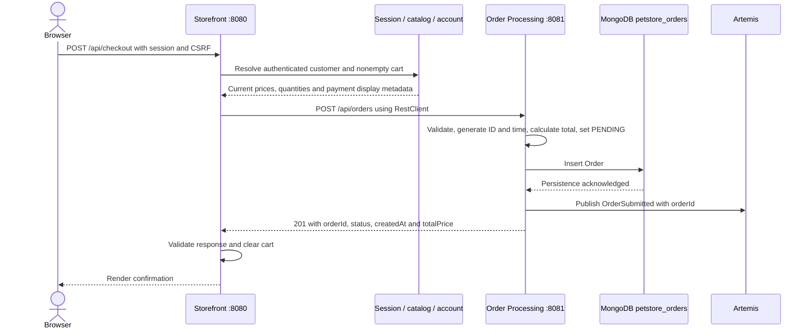
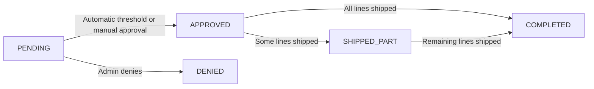

# Order processing and fulfilment

The implemented lifecycle separates order acceptance, approval and fulfilment. Browser traffic always goes through Storefront.

## Synchronous checkout

`POST /api/checkout?locale=en-US` requires authentication and CSRF. The browser supplies `billingInfo` and `shippingInfo` contact snapshots only. Identity/email come from the authenticated User/Customer, quantities from the server session, prices and category/product IDs from current CatalogService results. Sequential line numbers follow deterministic cart order. Catalog fallback remains requested locale → en-US → first detail; EST-15 does not gain a Japanese detail.

Storefront sends locally owned DTOs through RestClient (default Order Processing URL `http://localhost:8081`, connect/read timeouts 3s/5s). It never reads the orders database.

## Order snapshot and creation contract

`POST /api/orders` accepts customerId, username, email, locale, billingInfo, shippingInfo, payment, and lineItems. Contacts contain names, email, phone and address fields. Payment contains **cardType and last4 only**. Lines contain lineNumber, categoryId, productId, itemId, quantity and unitPrice.

Order Processing validates required IDs/contact fields, email format, nonempty lines, unique positive line numbers, positive quantities, nonnegative Decimal128-compatible prices and four-digit last4. It generates UUID/time/status and recalculates total with BigDecimal. Callers cannot supply a trusted total or status. The order-time snapshot is independent of Storefront models; fulfilment progress is persisted alongside it.

The response is HTTP 201 with Location `/api/orders/{orderId}` and `{orderId, status, createdAt, totalPrice}`. Its creation status is PENDING even if asynchronous processing advances the persisted document immediately afterward. The Location is an identifier; current reads use the internal Admin API rather than a customer history endpoint.

## Approval and lifecycle

OrderSubmitted on `petstore.order.submitted` contains only orderId. The listener reloads Mongo state and handles only PENDING orders. `ApprovalPolicy` uses BigDecimal.compareTo with strict thresholds:

| Locale | Automatically approve | Otherwise |
|---|---|---|
| en-US | total < 500 | Remain PENDING |
| ja-JP | total < 50000 | Remain PENDING |
| Any other locale | Never automatically | Remain PENDING |

Storefront `/admin/orders` proxies internal `/api/admin/orders` list/detail and `/{orderId}/approve` or `/deny` POSTs. Admin can filter all five statuses. Unknown IDs return 404 and non-PENDING decisions return 409. Automatic and manual approval share `OrderApprovalService`: an atomic PENDING → APPROVED update, then InventoryRequested publication. Denial atomically sets DENIED and publishes no inventory work. Concurrent decisions have one winner.

## Supplier allocation and invoice replacement

`petstore.inventory.requested` carries `{orderId, lines: [{lineNumber, itemId, quantity}]}` without prices, contacts or payment. Supplier uniquely persists orderId and verifies repeated requests match the original lines.

For every outstanding line, Supplier conditionally decrements stock only when quantity is sufficient for the **whole remaining line**. Insufficient/missing inventory ships none of that line, while other lines can ship. Mongo transactions commit stock, line progress and shipment history together. Quantity cannot become negative through concurrent allocation. SupplierOrder stays PENDING until all lines ship, then becomes COMPLETED.

Each successful pass records a UUID eventId, time, shipped lines and completion flag. It publishes `petstore.inventory.fulfilled` with `{eventId, orderId, shippedLines: [{lineNumber, itemId, quantity}], complete}`. No-new-shipment passes need not publish anything. This typed JSON message and persisted shipment history replace the business effect of legacy XML invoices, not invoice rendering.

Order Processing checks event IDs, line identity and quantities, rejects over-fulfilment and derives status from cumulative shipped amounts. Some lines shipped means SHIPPED_PART, all means COMPLETED. Duplicate events do not increment quantities again; optimistic concurrency protects competing updates. PENDING/DENIED/COMPLETED states remain protected from inappropriate transitions.

Supplier inventory is seeded from the original legacy XML: EST-1 through EST-29, 10000 each. Existing stock is not reset. `PUT /api/inventory/{itemId}` sets an exact nonnegative quantity. A positive update retries pending work and returns authoritative stock, which may already be lower after allocation. `POST /api/inventory/retry-pending` invokes the same algorithm. Supplier users access these through Storefront `/supplier/inventory` and `/supplier/orders`, never directly through port 8082.

## Payment and failure handling

Storefront stores only card type, last4 and expiry metadata. Full numbers are transient write-only registration/account input; startup migration removes legacy cardNumber. Checkout uses saved last4 directly. Orders contain no PAN/CVV. No payment authorization/tokenization or PCI compliance is claimed.

| Failure | Outcome |
|---|---|
| Empty cart / invalid checkout | Client error, cart retained |
| Missing saved customer/payment data | Deterministic client error, cart retained |
| HTTP timeout, connection error, downstream 4xx/5xx or invalid response | Non-sensitive 502, cart retained |
| Valid downstream 201 | Clear cart and confirm acceptance |
| OrderSubmitted send fails after insert | PENDING remains persisted, creation can fail and caller retry risks another order |
| InventoryRequested send fails after approval | APPROVED remains, API/listener may fail, replay/reconciliation required |
| InventoryFulfilled send fails after Supplier commit | Stock/progress/history remain committed, do not allocate those lines again |

Transacted JMS listeners let thrown processing failures use broker redelivery. Missing order IDs are handled without phantom records. Broker redelivery does not close the Mongo/JMS publication gap: a repeated delivery may find already-committed state and perform no new send. There is no outbox or automatic reconciliation. Recorded shipment events can support future controlled replay with their original event IDs.

Tests cover decimal calculations, HTTP failure semantics, policy boundaries, atomic decisions, concurrency, allocation, duplicate events, partial fulfilment and replenishment. Follow the [functional-verification guide](09-functional-verification.md) for the multi-service scenarios.
