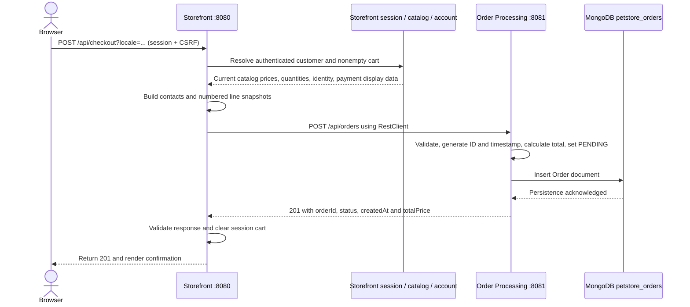
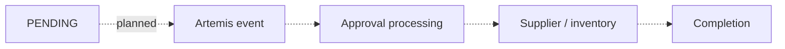

# Synchronous checkout and order creation

**Implemented checkpoint:** authenticated Storefront checkout creates an Order Processing snapshot over HTTP and displays confirmation. Processing stops at `PENDING`; no payment authorization, approval, inventory, fulfilment, or completion runs.

## Current flow



The browser never calls port 8081 directly. Supplier is not involved in this flow.

## Storefront request and snapshot ownership

`POST /api/checkout?locale=en-US` requires an authenticated HTTP session and CSRF. The browser supplies **only** `billingInfo` and `shippingInfo` contact/address snapshots; the page prefills them from `GET /api/account` and permits order-specific edits.

| Snapshot value | Authoritative source |
|---|---|
| `customerId`, `username`, account `email` | Authenticated principal → Storefront User → Customer |
| Billing/shipping contacts | Validated checkout request; do not change the saved account |
| Item IDs and quantities | Server-side ShoppingCart, in its deterministic sorted order |
| Category/product IDs and `unitPrice` | Current `CatalogService.getItem`, using requested locale resolution |
| `lineNumber` | Storefront assigns sequential numbers starting at 1 |
| `locale` | Normalized request locale; defaults to `en-US` |
| Payment display | Saved customer card type plus derived last4 only |

CatalogService remains authoritative for fallback: requested locale → en-US → first available detail. EST-15 has no Japanese item detail; Japanese checkout therefore uses its existing fallback price without synthesizing a detail row.

Storefront uses its own request/response DTOs and `RestClient`. The base URL and connect/read timeouts are configurable in `storefront-service/src/main/resources/application.properties` (defaults: `http://localhost:8081`, 3 seconds, 5 seconds). There is no order repository or order-service Java dependency in Storefront.

## Order Processing API and aggregate

`POST /api/orders` is an internal service API without browser session authentication.

Request fields:

- `customerId`, `username`, `email`, `locale`
- `billingInfo`, `shippingInfo`: first/last name, email, phone, street1/street2, city, stateOrProvince, postalCode, country
- `payment`: **cardType and last4 only**
- `lineItems`: lineNumber, categoryId, productId, itemId, quantity, unitPrice

The caller does not supply an order ID, createdAt, status, or trusted totalPrice. Unexpected top-level order fields and unexpected payment fields are rejected.

Order Processing:

1. Validates a nonempty line list, positive quantities/line numbers, unique line numbers, nonblank IDs, required contact fields/email syntax, nonnegative prices, and four-digit last4.
2. Checks that monetary values can be represented as Decimal128.
3. Generates a UUID order ID and current timestamp.
4. Calculates each `unitPrice × quantity` and sums the results using BigDecimal.
5. Sets status to `PENDING` and inserts one immutable `orders` aggregate in `petstore_orders`.
6. Returns **201**, a `Location: /api/orders/{orderId}` header, and this response shape:

```json
{
  "orderId": "<generated UUID>",
  "status": "PENDING",
  "createdAt": "<server timestamp>",
  "totalPrice": 49.50
}
```

The Location identifies the created resource; a GET/order-history API is **not implemented**.

The stored aggregate captures identity, locale, contacts, payment display, line items, createdAt, status, and totalPrice. Embedded records and copied line lists form an order-time snapshot. It has no Storefront class references or DBRefs, and does not query Storefront customer/catalog databases.

The lifecycle enum contains `PENDING`, `APPROVED`, `DENIED`, `SHIPPED_PART`, and `COMPLETED`. Enum membership does not mean transitions are implemented: only initial PENDING creation exists.

## Payment boundary

The legacy hard-coded checkout card is intentionally not reproduced. Storefront derives display information from the authenticated customer's saved account. No raw card number/PAN, CVV, or expiry credentials form part of the inter-service order request. Order Processing persists only `cardType` and `last4` for payment.

Storefront still persists a raw account card number. Removing/tokenizing that storage is a separate, unfinished security task. Neither service performs payment authorization or claims PCI compliance.

## Failure handling

| Condition | Storefront result | Cart |
|---|---|---|
| Anonymous request with valid CSRF | 401; UI sends user to login | Unchanged |
| Missing/invalid CSRF | 403; UI asks user to reload | Unchanged |
| Empty cart or invalid checkout fields | 400 | Unchanged |
| Missing required saved checkout/payment information | 409 | Unchanged |
| Connection failure or timeout | 502, non-sensitive error | Unchanged |
| Downstream 4xx/5xx | 502; downstream body is not exposed | Unchanged |
| Malformed/empty response, non-201 response, invalid fields, wrong status/total | 502 | Unchanged |
| Valid downstream 201 | Returns confirmation; cart is cleared afterward | Empty |

The client also checks the returned total against the submitted line values and requires an order ID, timestamp, and PENDING status. Logs capture creation boundaries, IDs, line counts, and status, not full contacts/payment payloads or downstream exception bodies.

**Limit:** HTTP acknowledgement loss can occur after persistence. Preserving the cart does not roll back a remote order. There is no cross-service transaction, automatic retry, or idempotency key/reconciliation mechanism in this checkpoint.

## Next asynchronous stage — NOT YET IMPLEMENTED



Verified legacy automatic-approval thresholds to revisit for parity:

- `en-US`: total **< 500**
- `ja-JP`: total **< 50000**

These rules do not execute today. Manual approval, message contracts, delivery/idempotency behavior, stock allocation, replenishment, invoices, and completion are future work. Approval and fulfilment remain distinct concepts established by the legacy investigation.

## Verification

Order creation tests use isolated Mongo databases and verify generated values, PENDING persistence, exact decimal totals, snapshot contents, and rejection rules. Storefront checkout tests use `MockRestServiceServer` to inspect outbound JSON and exercise success, HTTP errors, connection failures, timeouts, and invalid responses without running Order Processing in-process.

Page tests and a separate mocked-API browser smoke check cover the customer confirmation flow. These complement, rather than replace, a live multi-process demo. See [README testing](../README.md#testing).
