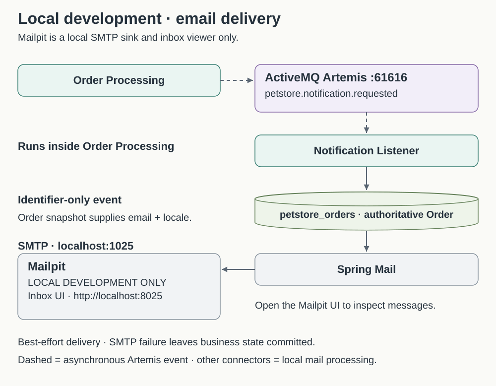

# Installation and setup

Start here on a clean Windows or macOS machine. **No IDE is required.** Choose [Windows PowerShell](#windows-1011-with-powershell) or [macOS Terminal](#macos) for installation, build and startup. Java applications run on the host; infrastructure runs in Docker Linux containers.

## 1. What is required

| Requirement | Windows host installation | Purpose |
| --- | --- | --- |
| Windows 10/11 on a Docker-supported release | Required | Check current Docker requirements and Windows servicing status; the version label alone is insufficient. |
| Internet access during first setup | Required | Download installers, Git source, Docker images, Maven and dependencies. |
| Git for Windows | Required | Clone the repository. |
| Java **JDK 21** | Required | Compile and run the three applications. A JRE alone is insufficient. |
| Docker Desktop | Required | Container engine and Docker Compose. |
| WSL 2 | Required for this guide's recommended Docker backend | Runs Linux containers; project commands still run in Windows PowerShell. |
| PowerShell | Required | Windows PowerShell 5.1 or a current PowerShell on Windows; Windows Terminal is an optional terminal host. |
| Web browser | Required | Customer, Admin, Supplier, Artemis console and Mailpit interfaces. |
| IntelliJ IDEA or another IDE | **Optional** | Editing/debugging convenience only. |

### Software you do not install separately

| Software | How this project supplies it |
| --- | --- |
| Maven | `mvnw.cmd` downloads the repository's Maven distribution on first use. |
| MongoDB | Runs in Docker from `compose.yaml`. |
| mongosh | Executed inside the Mongo container with `docker exec`. |
| ActiveMQ Artemis | Runs in Docker. |
| Mailpit | Runs in Docker as a local SMTP catcher. |
| Spring Boot | Resolved by Maven through project dependencies; no standalone installer. |
| Node.js / npm | Not required to build or run the application. Optional JavaScript presentation tests use Node.js; no npm dependencies are needed. |

Versions are taken from the checked-in POM/Compose configuration:

| Technology | Repository configuration |
| --- | --- |
| Java | 21 |
| Spring Boot | 4.1.1 |
| Maven Wrapper distribution | Maven 3.9.16 (`.mvn/wrapper/maven-wrapper.properties`) |
| MongoDB | `mongo:7.0`, single-node replica set **rs0** |
| ActiveMQ Artemis | `apache/artemis:2.57.0-alpine` |
| Mailpit | `axllent/mailpit:v1.27.8` |
| Spring Boot applications | Storefront, Order Processing, Supplier; three separate host Java processes |

This documentation update was prepared on macOS. Installer instructions were checked against official sources and project commands against the repository. Automated build results do not certify a fresh-machine installation. Independent Windows and macOS testers have supplied setup feedback; this documentation pass did not execute a fresh-machine installation. **Windows instructions require independent execution on a Windows machine.**

## Windows 10/11 with PowerShell

Run commands one line at a time, without copying a prompt character. Use normal Windows PowerShell unless a step explicitly says **Administrator PowerShell**. Do not paste these commands into cmd.exe, Git Bash or an Ubuntu/WSL terminal. An IDE is not part of the required path.

### 2. Windows machine preflight

Check the current [Docker Desktop Windows requirements](https://docs.docker.com/desktop/setup/install/windows-install/) before installing. Your Windows release must be supported and hardware virtualization enabled. Managed corporate laptops may need administrator approval for WSL, firmware settings, installation or network access.

In PowerShell:

```powershell
winver
$PSVersionTable.PSVersion
```

`winver` opens the Windows version dialog. In **Task Manager → Performance → CPU**, check **Virtualization: Enabled**. If disabled, follow the computer manufacturer's BIOS/UEFI instructions for Intel VT-x / AMD-V / SVM.

Allow free disk space for Docker's virtual disk, downloaded images, the checkout and Maven dependencies. As a practical development recommendation, use **16 GB system RAM** and **20 GB or more free disk space**, with room for growth. These are planning recommendations for three JVMs plus Mongo, Artemis and Mailpit, **not official Docker minimums**. Consult Docker's current requirements for supported hardware and software.

### 3. Install Git for Windows

1. Visit the official [Git for Windows download page](https://git-scm.com/install/windows).
2. Download Git for Windows for your architecture.
3. Run the installer.
4. Default choices are acceptable unless organizational policy requires otherwise.
5. Ensure the installer makes Git available from the command line.
6. Close and reopen PowerShell, then verify:

```powershell
git --version
```

Expected: a line beginning `git version ...`. No separate Git Bash workflow is required.

### 4. Install Java JDK 21 and configure JAVA_HOME

1. Open [Eclipse Adoptium / Temurin JDK 21 downloads](https://adoptium.net/temurin/releases/?version=21).
2. Select **Windows**.
3. Select **JDK**, version **21**, not JRE or a different default Java version.
4. Select the architecture matching **Settings → System → About → System type** (normally x64 for Intel/AMD PCs).
5. Prefer an **MSI** when available for your architecture.
6. Run the installer, following [Adoptium's Windows installer instructions](https://adoptium.net/installation/windows/).
7. Enable **Add to PATH** if offered.
8. Enable **Set/Update JAVA_HOME** if offered.
9. Finish installation.
10. Close and reopen PowerShell.

Verify all four:

```powershell
java -version
javac -version
$env:JAVA_HOME
Get-Command java
```

Both Java and `javac` must report **21**. `JAVA_HOME` must identify that JDK, and `Get-Command java` should identify its executable. Patch versions and installation folder names vary.

If `JAVA_HOME` or Java selection is wrong:

1. Open **Windows Search → Edit the system environment variables → Environment Variables**.
2. Create/edit `JAVA_HOME` in the appropriate System or User scope. System changes may require administrator access.
3. Browse to your installed **JDK root** in File Explorer. Use that directory as the value, without quotes and **without `\bin`**. Do not use a JRE directory.
4. Edit `Path` in the same scope. Add `%JAVA_HOME%\bin`; remove or move conflicting old Java entries as appropriate. Check both User and System variables if Java selection still disagrees.
5. Confirm all dialogs. Reopen PowerShell to load the updated environment.
6. Repeat the four checks above.

For the **current PowerShell session only**, replace the clearly marked placeholder with your actual installation directory:

```powershell
# Replace this placeholder before running; do not use it literally.
$env:JAVA_HOME = "C:\path\to\your\installed\jdk-21"
$env:Path = "$env:JAVA_HOME\bin;$env:Path"
java -version
javac -version
$env:JAVA_HOME
Get-Command java
```

### 5. Install or enable WSL 2

Docker Desktop will run Linux containers through its WSL 2 backend. Follow [Microsoft's official WSL installation guide](https://learn.microsoft.com/en-us/windows/wsl/install).

Open PowerShell with **Run as administrator** and check:

```powershell
wsl --version
```

If WSL is not installed, run:

```powershell
wsl --install
```

Restart when Windows asks. If Ubuntu opens and requests a Linux username/password, complete that initial distribution setup, then return to **Windows PowerShell**. After restart, in Administrator PowerShell:

```powershell
wsl --update
wsl --set-default-version 2
wsl --version
wsl --status
wsl --list --verbose
```

The **WSL software/package version** reported by `wsl --version` is separate from a **distribution's version 2**, shown by `wsl --list --verbose`. `--set-default-version 2` sets the default for new distributions; it does not convert existing version-1 distributions. Use Microsoft's instructions if an existing distribution needs conversion. An older WSL that does not understand `--version` needs updating.

If virtualization errors occur, check Task Manager and enable Intel VT-x / AMD-V / SVM in BIOS/UEFI using manufacturer guidance. Ask your administrator on a managed laptop.

**Do not install Java, Maven, MongoDB, Artemis or Petstore inside Ubuntu/WSL for this guide.** The checkout, JDK and project commands are on the Windows host.

### 6. Install and verify Docker Desktop

1. Download the installer from [Docker's official Windows installation page](https://docs.docker.com/desktop/setup/install/windows-install/), matching your architecture and supported Windows release.
2. Run the installer and follow the installation wizard.
3. Select/use the **WSL 2 backend** where offered.
4. Restart or sign out if requested.
5. Start **Docker Desktop** from the Start menu and complete its initial setup.
6. Wait until the engine is fully running.
7. Ensure it uses **Linux containers**; switch from Windows containers using Docker's menu if necessary.
8. Check **Settings → General → Use the WSL 2 based engine**, where applicable.

In a new **normal PowerShell** window:

```powershell
docker --version
docker compose version
docker info
```

`docker info` must include **Server/engine information** and `OSType: linux`, not just client information. **Do not continue until Docker works.** If commands are missing, reopen PowerShell after installation. If the daemon is unavailable or Docker is stuck starting, check Docker Desktop, WSL updates, virtualization, free disk/memory and pending restarts. Corporate proxies may block downloads. See [Windows troubleshooting](#17-windows-troubleshooting).

### 7. Clone the project and verify Maven Wrapper

Use a normal PowerShell window. Choose a local folder outside OneDrive or other synchronized Desktop/Documents folders to avoid sync-created duplicate source/build files. Replace the placeholder below with an existing parent directory, for example `C:\dev` (create it first if needed).

```powershell
cd "<parent-directory>"
git clone https://github.com/the-sagar/petstore-modernized.git
cd petstore-modernized
git status
.\mvnw.cmd -version
```

The repository root contains `pom.xml`, `mvnw.cmd` and `compose.yaml`. Run subsequent project commands there. `git status` should show a clean checkout on `main` for this exercise.

**Do not install Maven separately.** The wrapper downloads its configured Maven distribution on first use. Its output must show **Java version: 21...**. If it reports another Java version, **stop and fix JAVA_HOME before continuing**. A new terminal needs the correct environment too.

### 8. Understand what Docker starts

Compose runs infrastructure, **not the three Java applications**:

| Compose service | Container | Host port / URL | Persistence |
| --- | --- | --- | --- |
| `mongodb` | `petstore-mongodb` | `localhost:27017` (binding `27017:27017`) | `petstore-mongo-data` volume |
| `artemis` | `petstore-artemis` | Broker `localhost:61616`; console `http://localhost:8161/console` | `petstore-artemis-data` volume |
| `mailpit` | `petstore-mailpit` | SMTP `localhost:1025`; UI `http://localhost:8025` | No persistent volume configured |

Artemis binds `127.0.0.1:61616:61616` and `127.0.0.1:8161:8161`; Mailpit binds `127.0.0.1:1025:1025` and `127.0.0.1:8025:8025`. Mongo's current binding is not restricted to loopback by Compose. Use this configuration for local development, not as an Internet-exposed deployment.

The one Mongo process hosts service-owned databases `petstore_storefront`, `petstore_orders` and `petstore_supplier`. Mongo and Artemis named volumes survive normal `docker compose down`. Mailpit messages are temporary and may disappear when its container is recreated.

### 9. Start infrastructure

With Docker Desktop running, from the repository root:

```powershell
docker compose pull
docker compose up -d mongodb artemis mailpit
docker compose ps
```

Wait for all three services to be **running**. Mongo should become **healthy**; Artemis and Mailpit do not have Compose healthchecks. Mongo's healthcheck only verifies ping, not replica-set readiness.

Useful diagnostics:

```powershell
docker compose logs mongodb
docker compose logs artemis
docker compose logs mailpit
```

Resolve startup/port errors before continuing. Do not install these services natively to work around a container failure.

### 10. Initialize MongoDB replica set rs0

This step is required before building or launching the application. First verify Mongo itself:

```powershell
docker exec petstore-mongodb mongosh --quiet --eval "db.adminCommand({ping:1})"
```

Expected: `ok: 1`. This proves Mongo is running, but **does not prove the replica set is configured**. Then check:

```powershell
docker exec petstore-mongodb mongosh --quiet --eval "rs.status().ok"
```

There are two expected outcomes:

- **Case A — already initialized:** result `1` means `rs0` is configured. **DO NOT run `rs.initiate()` again.** Continue to the writable-primary check below.
- **Case B — fresh installation:** `MongoServerError: no replset config has been received` (or an equivalent no-configuration error such as `NotYetInitialized`) means Mongo is running but the fresh volume has no `rs0` configuration yet.

> **IMPORTANT — FIRST RUN ONLY**
>
> **This error is normal on the first run of a fresh MongoDB volume. It does not mean MongoDB failed to start.** Initialize `rs0` once using the command below, wait for election, then retry the status checks. Do not repeatedly run `rs.initiate()`.
>
> Normal `docker compose down` preserves the Mongo volume and its `rs0` configuration. **Destructive `docker compose down -v` removes the volume**, so initialization is required again after the next startup.

Only for Case B, run this PowerShell-safe command as one line:

```powershell
docker exec petstore-mongodb mongosh --eval "rs.initiate({_id:'rs0',members:[{_id:0,host:'localhost:27017'}]})"
```

Keep the outer double quotes and inner JavaScript single quotes exactly as shown. This is the existing Windows guide's quoting form, chosen to avoid embedded-double-quote differences between Windows PowerShell 5.1 and newer PowerShell. Do not replace it with the Bash quoting form.

Successful initiation commonly includes `ok: 1`; the rest of the response may vary. Wait about **5–10 seconds** for the single MongoDB member to become **PRIMARY**, then check:

```powershell
docker exec petstore-mongodb mongosh --quiet --eval "rs.status().ok"
docker exec petstore-mongodb mongosh --quiet --eval "db.hello().isWritablePrimary"
```

Expected output: **`1`**, then **`true`**. If primary is initially false, wait and recheck; inspect Mongo logs if it stays false. Continue to Maven build/startup only after **both checks pass**.

Parts of the application use Mongo transactions, including registration and Supplier allocation/progress updates. Standalone Mongo is insufficient. This is a **one-node LOCAL DEVELOPMENT replica set**, not production high availability. The advertised `localhost:27017` is correct because Java applications run on the host.

### 11. Verify Artemis and Mailpit

Open **http://localhost:8161/console**. Log in using the current local demo defaults **`petstore` / `petstore-dev`**. Successful login and broker startup logs establish that the console/broker started; the functional order exercises verify messaging end to end. Queues may appear only after the applications first use them.

Open **http://localhost:8025**. Mailpit is a **local SMTP catcher**. It needs no Gmail/Outlook account or credentials. With this repository's local configuration, messages addressed to `demo.customer@example.com` are caught here instead of delivered to the Internet. The address need not exist. Applications send SMTP to **port 1025**; port **8025** is the browser UI.

### 12. Build and test

From the repository root, with Mongo's `rs0` writable:

```powershell
.\mvnw.cmd clean verify
```

Allow time for first-use dependency downloads. Expected final output is **BUILD SUCCESS**, with Storefront, Order Processing and Supplier all successful and no failing tests. Tests use isolated Mongo databases and mock/isolate messaging, SMTP and downstream HTTP boundaries where applicable; automated tests do not require an IDE or Mailpit delivery.

Do not use an old documentation test count as the pass criterion. The current automated verification result is recorded in the [README](../README.md#testing); a macOS build does not establish Windows compatibility. Record your actual result, test totals and commit ID (`git rev-parse HEAD`) for the external exercise.

### 13. Run all three applications without IntelliJ

Four normal PowerShell windows/tabs are convenient. In **each**, change to the same repository root (`cd "C:\your\checkout\petstore-modernized"`, replacing that example path). Each application command stays running in its terminal.

**PowerShell 1 — infrastructure/status** (optional monitoring):

```powershell
docker compose ps
```

**PowerShell 2 — Storefront:**

```powershell
.\mvnw.cmd -pl storefront-service spring-boot:run
```

**PowerShell 3 — Order Processing:** set the flag in this window **before** starting Java:

```powershell
$env:NOTIFICATION_ENABLED = "true"
.\mvnw.cmd -pl order-processing-service spring-boot:run
```

**PowerShell 4 — Supplier:**

```powershell
.\mvnw.cmd -pl supplier-service spring-boot:run
```

Wait for all three application startup messages and their corresponding web-server port messages. Storefront alone is not enough for checkout or fulfilment.

| Application | Main class / startup name | Port |
| --- | --- | --- |
| Storefront | `com.mdb.petstore.PetstoreModernizedApplication` | 8080 |
| Order Processing | `com.mdb.petstore.orderprocessing.OrderProcessingApplication` | 8081 |
| Supplier | `com.mdb.petstore.supplier.SupplierApplication` | 8082 |

Startup should finish without exceptions. Open **http://localhost:8080**; it redirects to `/shop`. Browser application traffic uses **Storefront only**. A **404 at `http://localhost:8081/` or `http://localhost:8082/` is expected**: these are backend APIs, not browser homepages. There is no configured Actuator `/health` endpoint to check. Use startup logs plus the functional exercises.

Each `.\mvnw.cmd -pl <service> spring-boot:run` command starts Spring Boot as a **foreground process**. Its PowerShell window/tab stays occupied and must remain open while you use that service. Leave all three running for verification. When finished, **press Ctrl+C once in each PowerShell window/tab**: this sends an interrupt so that one Java/Spring Boot process shuts down cleanly. Closing a terminal forcibly may also terminate its process, but Ctrl+C is the recommended clean shutdown method.

Ctrl+C in the service windows stops **Storefront, Order Processing and Supplier**, one at a time. It does not stop Docker infrastructure; `docker compose down` stops **MongoDB, Artemis and Mailpit**. Environment variables set in one PowerShell window do not automatically reach another already-open window.

<a id="environment-and-demo-accounts"></a>

### 14. Local demo credentials and environment variables

| Identity | Current default | Browser entry |
| --- | --- | --- |
| Admin | `admin` / `admin` | `http://localhost:8080/login`, then `/admin/orders` or `/admin/statistics` |
| Supplier | `supplier` / `supplier` | `http://localhost:8080/login`, then `/supplier/inventory` or `/supplier/orders` |
| Customer | Register your own account | `http://localhost:8080/register` |
| Artemis | `petstore` / `petstore-dev` | `http://localhost:8161/console` |

These are **LOCAL DEMO defaults**, not production credentials. Admin and Supplier bootstrap create separate role-only users. Existing usernames are never silently promoted and existing passwords are not overwritten. Changing environment variables on an existing Mongo volume therefore does **not** necessarily change a bootstrapped user's password.

Set overrides before launch in the relevant terminal. For example, in Storefront's PowerShell window, replace the values before using them:

```powershell
$env:PETSTORE_ADMIN_USERNAME = "your-local-admin"
$env:PETSTORE_ADMIN_PASSWORD = "replace-with-your-local-value"
$env:PETSTORE_SUPPLIER_USERNAME = "your-local-supplier"
$env:PETSTORE_SUPPLIER_PASSWORD = "replace-with-your-local-value"
```

For the baseline exercise, leave the supplied credentials unchanged. If you override them, record your local choices privately.

| Actual environment variable | Current default | Consumer |
| --- | --- | --- |
| `PETSTORE_ADMIN_USERNAME`, `PETSTORE_ADMIN_PASSWORD` | `admin`, `admin` | Storefront bootstrap |
| `PETSTORE_SUPPLIER_USERNAME`, `PETSTORE_SUPPLIER_PASSWORD` | `supplier`, `supplier` | Storefront bootstrap |
| `PETSTORE_SUPPLIER_BASE_URL` | `http://localhost:8082` | Storefront Supplier client |
| `ARTEMIS_USER`, `ARTEMIS_PASSWORD` | `petstore`, `petstore-dev` | Compose and Order Processing/Supplier; keep consistent |
| `ARTEMIS_BROKER_URL` | `tcp://localhost:61616?initialConnectAttempts=1&reconnectAttempts=0&callTimeout=5000` | Order Processing/Supplier |
| `ORDER_SUBMITTED_DESTINATION` | `petstore.order.submitted` | Order Processing |
| `INVENTORY_REQUESTED_DESTINATION` | `petstore.inventory.requested` | Order Processing/Supplier |
| `INVENTORY_FULFILLED_DESTINATION` | `petstore.inventory.fulfilled` | Order Processing/Supplier |
| `NOTIFICATION_ENABLED` | **`true`** in current `application.properties` | Order Processing |
| `NOTIFICATION_REQUESTED_DESTINATION` | `petstore.notification.requested` | Order Processing |
| `NOTIFICATION_FROM` | `petstore@localhost` | Order Processing |
| `SMTP_HOST`, `SMTP_PORT` | `localhost`, `1025` | Order Processing |
| `SMTP_AUTH`, `SMTP_STARTTLS`, `SMTP_STARTTLS_REQUIRED` | `false`, `false`, `false` | Order Processing |
| `SPRING_MONGODB_URI` | Each service's `mongodb://localhost:27017/<service-database>?replicaSet=rs0` | Standard Spring override; preserve database ownership |

Storefront's `petstore.order-processing.base-url` is `http://localhost:8081`, with 3-second connect and 5-second read timeouts. Supplier client timeouts are also 3/5 seconds. Use the defaults for this guide. Broker volume initialization preserves configuration; changing `ARTEMIS_PASSWORD` alone is not a password-rotation procedure for an existing Artemis volume.

### 15. Enable and understand email

Notifications are configurable through **`petstore.notification.enabled` / `NOTIFICATION_ENABLED`**. The current checked-in default is **true**. Explicitly set it for the verification exercise so a previously inherited false value cannot disable email:

```powershell
$env:NOTIFICATION_ENABLED = "true"
.\mvnw.cmd -pl order-processing-service spring-boot:run
```

If Order Processing is already running, stop that process with Ctrl+C first; do not launch a second copy on port 8081. Setting a variable after launch does not reconfigure that running JVM.

Flow: **Order Processing → Artemis queue `petstore.notification.requested` → notification listener → Spring Mail → Mailpit SMTP 1025 → Mailpit UI 8025**. Messages contain workflow identifiers; the listener reloads the Order and uses its immutable checkout email snapshot. No fourth application or real mailbox is needed.

Approval, denial, each applied shipment pass, and completion request emails. A final shipment produces both shipped and completed notifications. Delivery is best-effort: SMTP failure is logged without reverting order/inventory state; failed SMTP attempts are acknowledged without automatic retry. Mongo/JMS are not atomic and SMTP/JMS exactly-once delivery is not claimed. Disabling notifications prevents new requests and stops the listener; queued requests can remain until re-enabled.

### 16. Windows installation success checklist

- [ ] `git --version` works.
- [ ] `java -version` is 21.
- [ ] `javac -version` is 21.
- [ ] `JAVA_HOME` points to JDK 21, not `bin`.
- [ ] `docker info` works and reports Linux server/engine information.
- [ ] `docker compose version` works.
- [ ] Mongo container is running.
- [ ] Artemis container is running.
- [ ] Mailpit container is running.
- [ ] Mongo ping succeeds.
- [ ] `rs.status().ok` returns `1`.
- [ ] `db.hello().isWritablePrimary` returns `true`.
- [ ] Artemis console opens and login works.
- [ ] Mailpit opens.
- [ ] Maven Wrapper reports Java 21.
- [ ] `clean verify` succeeds.
- [ ] Storefront starts on 8080.
- [ ] Order Processing starts on 8081, with notifications enabled.
- [ ] Supplier starts on 8082.
- [ ] Petstore home page opens at 8080.

Continue with the browser-driven [functional-verification exercise](09-functional-verification.md). No IntelliJ setup is necessary.

### 17. Windows troubleshooting

Start with the relevant application terminal and these infrastructure diagnostics from the repository root:

```powershell
docker compose ps
docker compose logs mongodb
docker compose logs artemis
docker compose logs mailpit
```

`docker compose logs <service>` means substitute a real Compose service name above, not a Java application name. Java logs are in the three PowerShell terminals.

| Symptom | Action |
| --- | --- |
| Git command not found | Finish Git for Windows installation with command-line PATH support; reopen PowerShell; run `git --version`. |
| Java command not found | Install Temurin **JDK 21**, enable PATH, reopen PowerShell. Check `Get-Command java`. |
| Java or javac reports another version | Follow the JAVA_HOME repair steps; check User and System PATH for an earlier Java executable. |
| JAVA_HOME incorrect | Use the actual JDK 21 root, not `bin`, a JRE, a quoted Environment Variables value or the example placeholder. |
| Maven Wrapper uses wrong Java | Check `.\mvnw.cmd -version`, not only `java -version`. Fix JAVA_HOME in that terminal and reopen terminals after persistent changes. |
| Maven/dependency download fails | Check Internet, proxy/firewall and certificate errors. Ask IT for approved Maven proxy/certificate settings rather than disabling TLS verification. Retry the same wrapper command after network repair. |
| Docker command missing | Install Docker Desktop and reopen PowerShell. WSL alone does not install Docker. |
| Docker daemon unavailable / Desktop not started | Start Docker Desktop; wait for engine readiness and rerun `docker info`. |
| WSL unavailable or outdated | Use Administrator PowerShell for `wsl --install` when missing, restart as requested, then `wsl --update`; verify version/status against Docker's current requirements. |
| Virtualization disabled | Check Task Manager → Performance → CPU. Enable VT-x / AMD-V / SVM using vendor BIOS/UEFI guidance; ask IT if managed. |
| Docker Desktop stuck starting | Check pending restart, virtualization, WSL updates, free RAM and disk. Quit Docker; if needed run `wsl --shutdown` (stops all WSL sessions), then restart Docker. Use Docker's Troubleshoot diagnostics; do not factory-reset as a first step. |
| Corporate proxy blocks Docker pulls | Configure Docker Desktop's proxy using organizational guidance; verify `docker compose pull`. Maven/Git may need their own approved proxy settings. |
| Port already in use | Check all ports below. Stop the known conflicting process or duplicate Petstore terminal; do not randomly change dependent service URLs or kill unknown processes. |
| `MongoServerError: no replset config has been received` | Normal on a fresh volume: Mongo is running but has no `rs0` configuration. Run the one-time PowerShell `rs.initiate` command above, wait 5–10 seconds for election, then verify `rs.status().ok` returns `1` and `db.hello().isWritablePrimary` returns `true`. |
| `Transaction numbers are only allowed on a replica set member or mongos` | Unlike the normal first-run status error, this usually means the application reached Mongo before the replica set was correctly initialized/usable, or connected to standalone Mongo/the wrong URI. Use Compose Mongo with initialized `rs0` and the default `?replicaSet=rs0` service URIs. Check for an unintended `SPRING_MONGODB_URI` override. |
| Artemis authentication failure | Check `ARTEMIS_USER`/`ARTEMIS_PASSWORD` in the Compose shell and both Order Processing/Supplier terminals. Existing broker-volume credentials may differ from new environment values. Inspect Artemis logs. |
| Mailpit UI unavailable | Check `docker compose ps`, `docker compose logs mailpit`, and port 8025. SMTP port 1025 is not an HTTP page. |
| Orders process but emails are missing | In Order Processing's terminal set `NOTIFICATION_ENABLED=true` and restart that service. Check `SMTP_HOST=localhost`, `SMTP_PORT=1025`, Mailpit/broker readiness, and logs for `Notification requested`, `Notification email sent` or `Notification email delivery failed`. Test with a new order: enabling email does not recreate requests skipped while disabled. |
| Storefront works but checkout returns 502 | Confirm Order Processing is running on 8081, Mongo is writable and Artemis is reachable. Inspect both Java terminals. A 502 means creation could not be confirmed, not proof that nothing persisted; check Admin before retrying to avoid an unintended second order. |
| Supplier page unavailable / data fails to load | Log in as Supplier, confirm Supplier startup on 8082, check its terminal and Storefront's `PETSTORE_SUPPLIER_BASE_URL`. Backend/client failures may return 502. |
| Admin/Supplier returns 403 | Use the required role. CUSTOMER cannot access either area, and ADMIN alone is not SUPPLIER. Use separate browser profiles or log out/in with the correct account. |
| Backend root returns 404 | Normal on 8081/8082. Open the application through 8080. |
| PowerShell syntax errors | Use `.\mvnw.cmd` and `$env:NAME = "value"`. Do not use Bash `export`, cmd.exe `set`, Bash line-continuation backslashes or Linux paths. Preserve the rs.initiate quoting shown above. |
| Duplicate class / multiple main classes during build | Check for sync-generated numbered copies in source or `target`. Keep the checkout outside OneDrive/cloud-synced folders. Do not delete source blindly; generated `target` contents are recreated by Maven. |

Inspect port ownership without terminating anything:

```powershell
$petstorePorts = 27017, 61616, 8161, 1025, 8025, 8080, 8081, 8082
Get-NetTCPConnection -State Listen -ErrorAction SilentlyContinue | Where-Object { $_.LocalPort -in $petstorePorts } | Select-Object LocalAddress, LocalPort, OwningProcess
```

Use `Get-Process -Id <OwningProcess>` with an actual PID from that output to identify the owner. Docker's listening ports may belong to Docker's host process.

### 18. Stop, restart and reset

Normal shutdown:

1. Stop Storefront with **Ctrl+C** in its PowerShell window/tab.
2. Stop Order Processing with **Ctrl+C** in its PowerShell window/tab.
3. Stop Supplier with **Ctrl+C** in its PowerShell window/tab.
4. From the repository root, stop MongoDB, Artemis and Mailpit:

```powershell
docker compose down
```

Mongo and Artemis named volumes are preserved. Start again with:

```powershell
docker compose up -d mongodb artemis mailpit
```

Recheck Mongo primary status, then run the three application commands again. Do not initialize an already configured replica set. Mailpit has no configured persistence, so save test evidence before recreating its container.

**DANGER — DESTRUCTIVE RESET, NOT AN ORDINARY TESTING STEP:**

```powershell
docker compose down -v
```

**This deletes Mongo and Artemis local persisted state: accounts, catalog, orders, inventory, fulfilment history and broker messages. It requires `rs0` initialization again.** Use only when intentionally discarding the entire local demo dataset. Afterward, start infrastructure, initialize the fresh replica set, and restart applications to seed/bootstrap baseline data. Do not use `-v` during ordinary testing or as a first response to errors.

## macOS

### 1. Requirements

This path starts with a clean Mac and uses **Terminal, without an IDE**. Java runs on the Mac; MongoDB, Artemis and Mailpit run in Docker. Use a directory outside iCloud Drive or other synchronized folders for the checkout and build output.

| Tool or requirement | Required? |
| --- | --- |
| A macOS release supported by Docker Desktop | Required; check the current official requirements before installing. |
| Internet access during setup | Required for installers, source, Docker images and Maven dependencies. |
| Git | Required; Apple's Command Line Tools are the primary installation method below. |
| Java **JDK 21** | Required; a JRE is insufficient. |
| Docker Desktop | Required; includes the engine and Compose. |
| Terminal and a web browser | Required; Terminal is in Applications → Utilities. |
| IntelliJ IDEA or another IDE | Optional. |
| Homebrew | Optional; none of the primary steps require it. |

**Do not install separately:** Maven comes through `./mvnw`; MongoDB runs in Docker; `mongosh` runs inside the Mongo container; Artemis and Mailpit run in Docker; Spring Boot is a Maven dependency; Node.js/npm are not required to build or run the application (optional presentation tests use Node.js without npm dependencies).

The checked-in stack is **Java 21, Spring Boot 4.1.1, MongoDB `mongo:7.0` with single-node replica set `rs0`, Artemis `apache/artemis:2.57.0-alpine`, and Mailpit `axllent/mailpit:v1.27.8`**. Storefront, Order Processing and Supplier are three Spring Boot applications. The wrapper downloads Maven 3.9.16.

Allow free disk space for images and dependencies, and free memory for Docker plus three JVMs. More RAM than Docker's own minimum is useful for this combined workload; this guide does not define a measured project minimum. Managed Macs may need administrator or IT approval for installations and network access.

### 2. Check Apple silicon versus Intel

In Terminal, run:

```bash
uname -m
```

- `arm64`: Apple silicon; choose ARM64/aarch64 JDK and Apple silicon Docker installers.
- `x86_64`: Intel; choose x64 JDK and Intel Docker installers.

Also check **Apple menu → About This Mac**. On Apple silicon, a Terminal session running under Rosetta can report `x86_64`; use a native Terminal session where practical and use About This Mac to confirm the actual hardware.

### 3. Install Git

Use Apple's Command Line Tools:

```bash
xcode-select --install
```

Accept the installation dialog and wait for completion. This installs Git and common developer command-line tools; **full Xcode is not required**. An “already installed” message is normal if the tools are present. Close and reopen Terminal, then check:

```bash
git --version
```

Expect `git version ...`. See [Apple's Command Line Tools instructions](https://developer.apple.com/documentation/xcode/installing-the-command-line-tools/) and [Git's macOS installation options](https://git-scm.com/install/mac). If you already use Homebrew, `brew install git` is an optional alternative, not a prerequisite.

### 4. Install Java JDK 21 and set JAVA_HOME

Install a **JDK, not a JRE**; this project requires Java 21.

1. Open the official [Eclipse Temurin releases page](https://adoptium.net/temurin/releases/?version=21).
2. Select **JDK**, version **21**, **macOS**, and **aarch64/ARM64** for Apple silicon or **x64** for Intel.
3. Download the **.pkg** installer, open it and complete installation. See [Adoptium's macOS installer instructions](https://adoptium.net/installation/macOS/).
4. Close and reopen Terminal.

List installed JDKs and check the active compiler/runtime:

```bash
/usr/libexec/java_home -V
java -version
javac -version
```

Both Java and javac must report **21**. If another version is active, select the installed JDK 21 in the current shell:

```bash
export JAVA_HOME=$(/usr/libexec/java_home -v 21)
export PATH="$JAVA_HOME/bin:$PATH"
```

`JAVA_HOME` identifies the JDK home directory, not its `bin` subdirectory. Maven uses it to select Java. If `java_home` cannot find version 21, finish installing the JDK before continuing.

For the default Zsh shell, persist these settings in `~/.zshrc`. **If that file already sets JAVA_HOME or Java-related PATH entries, edit those lines instead of appending conflicting settings.** Otherwise these quoted commands append the expressions without expanding them prematurely:

```bash
echo 'export JAVA_HOME=$(/usr/libexec/java_home -v 21)' >> ~/.zshrc
echo 'export PATH="$JAVA_HOME/bin:$PATH"' >> ~/.zshrc
source ~/.zshrc
```

Verify again:

```bash
echo "$JAVA_HOME"
java -version
javac -version
```

### 5. Install Docker Desktop for Mac

1. Open the official [Docker Desktop macOS installation page](https://docs.docker.com/desktop/setup/install/mac-install/) and check its current supported macOS requirements.
2. Download the **Apple silicon** or **Intel** installer matching your Mac.
3. Open `Docker.dmg` and drag Docker to **Applications**.
4. Launch Docker Desktop from Applications, review its terms and approve the required setup permissions.
5. Wait until the Docker engine reports that it is running.

Docker Desktop runs the project's MongoDB, Artemis and Mailpit containers. In Terminal verify:

```bash
docker --version
docker compose version
docker info
```

`docker info` must return **server/engine information** for Linux containers, not just a client version or connection error. **Do not continue until this works.** Docker Desktop must remain running while using the application.

### 6. Clone the project and check Maven Wrapper

Choose a parent directory outside cloud synchronization. Replace the placeholder below with its actual path; do not type the angle brackets literally:

```bash
cd "<parent-directory>"
git clone https://github.com/the-sagar/petstore-modernized.git
cd petstore-modernized
git status
./mvnw -version
```

Maven does **not** need a separate installation. The first wrapper invocation may download Maven. Its output must show **Java version 21**; if it shows another version, fix `JAVA_HOME` before continuing.

If the wrapper reports permission denied, run from the repository root:

```bash
chmod +x mvnw
./mvnw -version
```

All remaining project commands run from the repository root unless stated otherwise.

### 7. Understand Docker services and ports

Compose starts infrastructure only; the Java applications start separately in Terminal.

| Compose service | Container | Host endpoint |
| --- | --- | --- |
| `mongodb` | `petstore-mongodb` | `localhost:27017` (Compose binds `27017:27017`, not loopback-only) |
| `artemis` | `petstore-artemis` | Broker `127.0.0.1:61616`; console `http://localhost:8161/console` (loopback binding) |
| `mailpit` | `petstore-mailpit` | SMTP `127.0.0.1:1025`; UI `http://localhost:8025` (loopback binding) |

MongoDB and Artemis use named persistent volumes, which survive normal `docker compose down`. Mailpit has no persistent volume in this configuration; do not rely on captured emails surviving container recreation.

### 8. Start infrastructure

```bash
docker compose pull
docker compose up -d mongodb artemis mailpit
docker compose ps
```

Expect all three services to be running; Mongo should become healthy. Its health check tests connectivity, **not replica-set readiness**, so the next step is still required. Inspect startup problems with:

```bash
docker compose logs mongodb
docker compose logs artemis
docker compose logs mailpit
```

### 9. Initialize MongoDB replica set rs0

First verify Mongo itself:

```bash
docker exec petstore-mongodb mongosh --quiet --eval 'db.adminCommand({ping:1})'
```

Expected: `ok: 1`. This proves Mongo is running, but **does not prove the replica set is configured**. Then check:

```bash
docker exec petstore-mongodb mongosh --quiet --eval 'rs.status().ok'
```

There are two expected outcomes:

- **Case A — already initialized:** result `1` means `rs0` is configured. **DO NOT run `rs.initiate()` again.** Continue to the writable-primary check below.
- **Case B — fresh installation:** `MongoServerError: no replset config has been received` (or an equivalent no-configuration error such as `NotYetInitialized`) means Mongo is running but the fresh volume has no `rs0` configuration yet.

> **IMPORTANT — FIRST RUN ONLY**
>
> **This error is normal on the first run of a fresh MongoDB volume. It does not mean MongoDB failed to start.** Initialize `rs0` once using the command below, wait for election, then retry the status checks. Do not repeatedly run `rs.initiate()`.
>
> Normal `docker compose down` preserves the Mongo volume and its `rs0` configuration. **Destructive `docker compose down -v` removes the volume**, so initialization is required again after the next startup.

Only for Case B, run:

```bash
docker exec petstore-mongodb mongosh --eval \
'rs.initiate({_id:"rs0",members:[{_id:0,host:"localhost:27017"}]})'
```

Successful initiation commonly includes `ok: 1`; the rest of the response may vary. A connection failure is not evidence that initialization is needed: first check the running container and its logs. Wait about **5–10 seconds** for the single MongoDB member to become **PRIMARY**, then verify:

```bash
docker exec petstore-mongodb mongosh --quiet --eval 'rs.status().ok'
docker exec petstore-mongodb mongosh --quiet --eval 'db.hello().isWritablePrimary'
```

Expected results are **`1`** and **`true`**, respectively. Retry these read-only checks if election is still in progress. Continue to Maven build/startup only after **both checks pass**.

Application Mongo transactions require the replica set. `rs0` here is a **one-node local development** configuration, not production high availability. Existing volumes retain initialization across normal restarts.

### 10. Verify Artemis and Mailpit

Open **http://localhost:8161/console**. Log in using the current local defaults **`petstore` / `petstore-dev`**, unless you supplied `ARTEMIS_USER` / `ARTEMIS_PASSWORD` overrides. These are local development credentials. If overridden, use matching credentials when launching Order Processing and Supplier too.

Open **http://localhost:8025**. Mailpit is a **local SMTP sink**: no Gmail/Outlook account is needed. Messages addressed to syntactically valid fake addresses such as `local.tester@example.com` appear here rather than being delivered to the Internet. The application connects to SMTP on **1025**; **8025** is the browser UI.

### 11. Build and test

With Mongo `rs0` writable, run:

```bash
./mvnw clean verify
```

Expect the final result **`BUILD SUCCESS`** with no failing tests. Use the test counts printed by this execution as evidence for your checked-out commit. See the [README](../README.md#testing) for the current automated result; it is not a clean-machine installation test. Automated mail tests use mocks and do not require Mailpit.

If duplicate classes or numbered copies of build artifacts appear under `target`, investigate iCloud/file synchronization; this is an environment problem, not normal project output. See troubleshooting below before rebuilding.

### 12. Start all three services without IntelliJ

Use **three Terminal windows/tabs**, each opened in the repository root. Environment exports apply only to processes started from that shell. Keep each process running while you use the application.

**Terminal 1 — Storefront:**

```bash
./mvnw -pl storefront-service spring-boot:run
```

**Terminal 2 — Order Processing:** notifications currently default to **true**. This explicit setting ensures that the verification exercise includes email, even if your shell previously disabled it:

```bash
export NOTIFICATION_ENABLED=true
./mvnw -pl order-processing-service spring-boot:run
```

**Terminal 3 — Supplier:**

```bash
./mvnw -pl supplier-service spring-boot:run
```

Wait for successful startup in each terminal:

| Application | Port | Startup main class |
| --- | --- | --- |
| Storefront | 8080 | `com.mdb.petstore.PetstoreModernizedApplication` |
| Order Processing | 8081 | `com.mdb.petstore.orderprocessing.OrderProcessingApplication` |
| Supplier | 8082 | `com.mdb.petstore.supplier.SupplierApplication` |

Check for the corresponding `Started ...Application` message and absence of startup errors. Open **http://localhost:8080** for the application. Backend roots **http://localhost:8081/** and **http://localhost:8082/** may return **404**, because they are API services, not browser homepages; a root 404 alone is not a health failure. Use startup logs and the linked functional checks to verify service interaction; there is no documented actuator health endpoint.

Each `./mvnw -pl <service> spring-boot:run` command starts Spring Boot as a **foreground process**. Its Terminal window/tab stays occupied and must remain open while you use that service. When finished, **press Ctrl+C once in each Terminal window/tab**: this sends an interrupt so that one Java/Spring Boot process shuts down cleanly. Closing a terminal forcibly may also terminate its process, but Ctrl+C is the recommended clean shutdown method.

Ctrl+C in the service terminals stops **Storefront, Order Processing and Supplier**, one at a time. It does not stop Docker infrastructure; `docker compose down` stops **MongoDB, Artemis and Mailpit**.

### 13. Local accounts and environment overrides

| Identity | Local default | Browser entry |
| --- | --- | --- |
| Admin | `admin` / `admin` | `/login`, then `/admin/orders` or `/admin/statistics` |
| Supplier | `supplier` / `supplier` | `/login`, then `/supplier/inventory` or `/supplier/orders` |
| Customer | Register your own account | `/register` |

These are **local demo defaults, not production credentials**. To choose different bootstrap accounts, replace these example values and export them **in the Storefront terminal before launch**:

```bash
export PETSTORE_ADMIN_USERNAME='local-admin'
export PETSTORE_ADMIN_PASSWORD='replace-with-your-local-admin-password'
export PETSTORE_SUPPLIER_USERNAME='local-supplier'
export PETSTORE_SUPPLIER_PASSWORD='replace-with-your-local-supplier-password'
```

Bootstrap does not overwrite an existing user's password or roles. Changing these variables is not a password-reset mechanism for users already stored in Mongo. Use distinct Admin/Supplier usernames. Shell exports affect apps launched from that shell; another tab does not inherit exports made after it was opened. See the shared [environment variable table](#environment-and-demo-accounts) for broker, SMTP and service URL overrides.

### 14. Email notifications

Order Processing uses `petstore.notification.enabled=${NOTIFICATION_ENABLED:true}`: **enabled by default** on current main. Set `export NOTIFICATION_ENABLED=true` before starting it to explicitly enable delivery, or `export NOTIFICATION_ENABLED=false` to disable it. Restart that service after changing its environment.

The local flow is:



Identifier-only events cause the listener to reload the authoritative Order and its order-time email. Approved/denied decisions produce status emails; each new shipment pass produces a shipped email; final fulfilment also produces a completed email. Fake customer addresses are acceptable locally.

Defaults are `SMTP_HOST=localhost`, `SMTP_PORT=1025`, `SMTP_AUTH=false`, `SMTP_STARTTLS=false`, `SMTP_STARTTLS_REQUIRED=false`, and `NOTIFICATION_FROM=petstore@localhost`. The queue override is `NOTIFICATION_REQUESTED_DESTINATION`. No local SMTP authentication or TLS is required. These names are environment overrides; standard Spring Mail properties can also be supplied externally.

Email is **best-effort and non-blocking for business state**. Delivery/publication failures are logged without undoing approval, denial or fulfilment. SMTP failures are not automatically retried. Mongo updates, JMS publication and SMTP delivery are not an exactly-once transaction; messages can be lost or duplicated across failures. Disabling notifications stops new requests and the listener; queued requests can be consumed when re-enabled.

### 15. macOS installation success checklist

- [ ] `uname -m` understood and installer architectures match the Mac.
- [ ] `git --version` works.
- [ ] `java -version` shows 21.
- [ ] `javac -version` shows 21.
- [ ] `JAVA_HOME` points to JDK 21.
- [ ] `docker info` returns engine information.
- [ ] `docker compose version` works.
- [ ] Mongo is running.
- [ ] Artemis is running.
- [ ] Mailpit is running.
- [ ] Mongo ping succeeds.
- [ ] `rs.status().ok` returns `1`.
- [ ] `db.hello().isWritablePrimary` returns `true`.
- [ ] Artemis console opens and login works.
- [ ] Mailpit UI opens.
- [ ] `./mvnw -version` shows Java 21.
- [ ] `./mvnw clean verify` succeeds.
- [ ] Storefront starts on 8080.
- [ ] Order Processing starts on 8081.
- [ ] Supplier starts on 8082.
- [ ] Petstore opens at http://localhost:8080.

Continue with [functional verification](09-functional-verification.md). **Independent execution from scratch on a separate clean Mac is still required to validate this installation guide.**

### 16. macOS troubleshooting

| Symptom | Check / action |
| --- | --- |
| `xcode-select` says tools already installed | Check `git --version`; no full Xcode installation is needed. |
| Git not found | Complete Command Line Tools installation, reopen Terminal and retry. Managed installations may require IT help. |
| Java not found | Install the JDK 21 `.pkg`, then check `/usr/libexec/java_home -V`. |
| Wrong Java or incorrect JAVA_HOME | Select version 21 with `java_home`, export JAVA_HOME and prepend its `bin` to PATH as above. JAVA_HOME must be the JDK home, not `bin`. |
| Java changes between shells | Inspect `~/.zshrc` and other shell startup files for competing JAVA_HOME/PATH settings; edit existing entries rather than appending duplicates. |
| `./mvnw` permission denied | Run `chmod +x mvnw` from the repository root and retry. |
| Maven Wrapper selects wrong Java | Check `echo "$JAVA_HOME"`, `java -version` and `./mvnw -version` in that same terminal; repair JAVA_HOME before building. |
| Maven download fails | Verify Internet/proxy access to Maven Central and the wrapper distribution URL. Follow organizational proxy/certificate guidance rather than disabling TLS validation. |
| `docker` command not found | Complete Docker Desktop installation/CLI setup, then reopen Terminal and verify PATH. |
| Cannot connect to Docker daemon | Start Docker Desktop and wait for engine readiness; retry `docker info`. A working client command alone is insufficient. |
| Wrong Apple silicon/Intel installer | Check About This Mac and native `uname -m`; install the matching Docker/JDK architecture. |
| Docker stuck starting or permissions denied | Check Docker Desktop diagnostics, macOS security/permission prompts, supported macOS version and free resources. Ask IT about managed-device restrictions. |
| Pulls fail on corporate network | Review Docker Desktop proxy configuration and permitted registry/network access with IT. |
| Port already in use | Check all required ports: **27017, 61616, 8161, 1025, 8025, 8080, 8081, 8082**. Identify the process before stopping anything; avoid launching duplicate services in IDE and Terminal. |
| `MongoServerError: no replset config has been received` | Normal on a fresh volume: Mongo is running but has no `rs0` configuration. Run the one-time macOS `rs.initiate` command above, wait 5–10 seconds for election, then verify `rs.status().ok` returns `1` and `db.hello().isWritablePrimary` returns `true`. |
| `Transaction numbers are only allowed on a replica set member or mongos` | Unlike the normal first-run status error, this usually means the application reached Mongo before the replica set was correctly initialized/usable. Verify both rs0 checks above before building/starting the app; also check that it connects to the intended Compose Mongo instance. |
| Artemis authentication fails | Match `ARTEMIS_USER` / `ARTEMIS_PASSWORD` between broker configuration and both consuming services. Existing broker volume credentials may differ from newly supplied values; do not delete volumes as a routine fix. |
| Mailpit UI unavailable | Check Mailpit container/logs and port 8025; SMTP 1025 is not a browser UI. |
| Emails absent | Check Order Processing's effective `NOTIFICATION_ENABLED` (default true), SMTP settings and logs; ensure Mailpit and Artemis run and the order actually transitioned. Restart after shell changes. Best-effort delivery does not guarantee replay of failed emails. |
| Storefront works but checkout returns 502 | Check Order Processing on 8081 and its Mongo/Artemis logs. Cart retention is expected; a timeout does not prove that no order was persisted. |
| Supplier page unavailable | Check Supplier startup on 8082, Storefront proxy configuration and the Supplier login role. Browse through Storefront 8080. |
| Admin/Supplier returns 403 | Sign in with the matching role; Admin is not automatically Supplier. Customer accounts cannot access either protected area. |
| Backend root returns 404 | Expected for backend API roots; use Storefront 8080 and functional checks. |
| Numbered duplicate files/classes from iCloud | Keep checkout/build output outside synchronized folders. Review `git status` and duplicates before removing anything; do not delete source files blindly. Once synchronization is resolved, `./mvnw clean verify` regenerates build artifacts. |

Useful read-only diagnostics:

```bash
lsof -i :8080
lsof -i :27017
docker compose ps
docker compose logs mongodb
docker compose logs artemis
docker compose logs mailpit
```

Substitute another port in `lsof` as needed. Use macOS/Zsh syntax here: Windows PowerShell's `$env:NAME` and `mvnw.cmd` are not the macOS commands.

### 17. Stop, restart and reset

Normal shutdown:

1. Stop Storefront with **Ctrl+C** in its Terminal window/tab.
2. Stop Order Processing with **Ctrl+C** in its Terminal window/tab.
3. Stop Supplier with **Ctrl+C** in its Terminal window/tab.
4. From the repository root, stop MongoDB, Artemis and Mailpit:

```bash
docker compose down
```

MongoDB and Artemis volumes are **preserved**. Restart infrastructure with:

```bash
docker compose up -d mongodb artemis mailpit
```

Verify Mongo is writable, then start the three applications again. Normal restarts do not require `rs.initiate` again.

**Destructive reset — not for ordinary testing:**

```bash
docker compose down -v
```

**WARNING: this deletes local persisted MongoDB and Artemis data, including accounts, orders, inventory/stock and broker state/messages.** After a deliberate full volume reset, start infrastructure again and initialize `rs0` again before starting applications. Do not use `-v` for normal shutdown or troubleshooting.

## IntelliJ project setup

**Entirely optional:** these UI steps are for users who choose to install IntelliJ IDEA after completing either OS path. Neither OS terminal startup procedure depends on them. If you started services in terminals, stop them before launching the same services from IntelliJ to avoid duplicate processes and port conflicts.

1. Select **File → Open**, choose the repository root or its root `pom.xml`, and open/import it as a **Maven project**. Do not import the service folders as separate projects.
2. Under **File → Project Structure → Project → SDK**, select **JDK 21**. If absent, use **Add SDK → JDK** and browse to the installed JDK home. Use language level 21 or the SDK default.
3. Open **Settings → Build, Execution, Deployment → Build Tools → Maven** (Settings is under the IntelliJ IDEA menu on macOS). Select **Maven Wrapper** for Maven home.
4. In Maven's **Runner**, set JRE to JDK 21 / Project SDK. In **Importing**, also choose JDK 21 for the importer JDK where the setting is available. Menu wording can vary by IDE version.
5. Wait for dependency downloads and indexing to finish. If modules are missing, use the Maven tool window's reload action for the root project.
6. Open **Run → Edit Configurations → + → Spring Boot**. Create the following configurations, selecting JDK 21 and the corresponding module's classpath (it may be displayed with a `.main` suffix):

| Configuration name | Module | Main class |
| --- | --- | --- |
| Storefront Service | `storefront-service` | `com.mdb.petstore.PetstoreModernizedApplication` |
| Order Processing Service | `order-processing-service` | `com.mdb.petstore.orderprocessing.OrderProcessingApplication` |
| Supplier Service | `supplier-service` | `com.mdb.petstore.supplier.SupplierApplication` |

If Spring Boot configuration support is unavailable, choose **Application** with the same main class, module and JDK. The application can run without paid Spring-specific IDE integration.

7. For each configuration, use the repository root as the working directory. No profile or environment override is required for the local defaults. Set any overrides in that individual configuration's **Environment variables** field; see [environment and demo accounts](#environment-and-demo-accounts).
8. Select **+ → Compound**, name it **Petstore - All Services**, and add all three configurations. Apply and save.
9. Keep Docker Desktop running and complete the Mongo primary, Artemis and Mailpit checks from your OS path before running the Compound configuration. It starts Java services, not the infrastructure.
